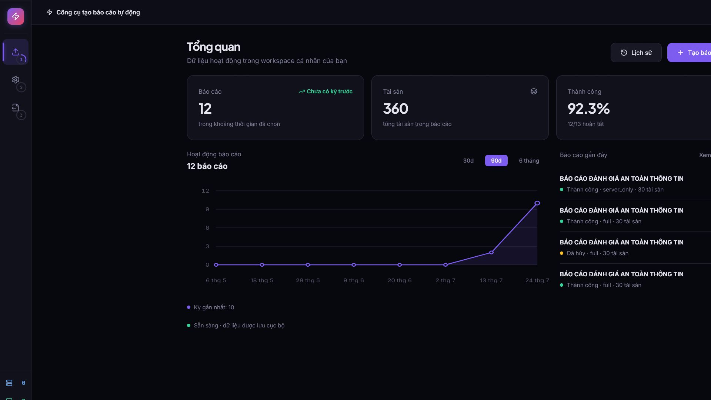
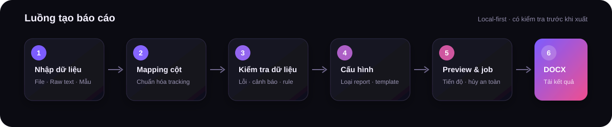
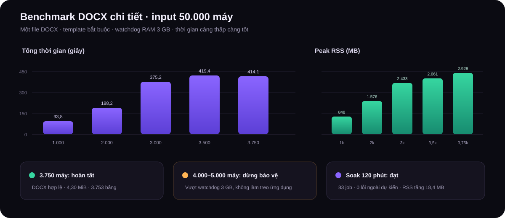

<div align="center">

# Reporter Pro

**Local-first DFIR & Compromise Assessment report automation**

[](https://github.com/Eyblcat12/Reporter4CA-/actions/workflows/ci.yml)
[](LICENSE)
[](.python-version)
[](.nvmrc)
[](INSTALL.md)

[Bắt đầu](#bắt-đầu-nhanh) · [Tính năng](#tính-năng-chính) · [Benchmark](#benchmark-thực-tế) · [Tài liệu](#tài-liệu) · [Đóng góp](CONTRIBUTING.md)

</div>



Reporter Pro tự động hóa quá trình tạo báo cáo DFIR và Compromise Assessment từ
dữ liệu tracking. Ứng dụng kết hợp giao diện React, API FastAPI và template Word
để import, kiểm tra chất lượng dữ liệu, phân tích finding, xem trước và xuất báo
cáo DOCX có cấu trúc nhất quán.

> **Phạm vi hiện tại:** tối ưu cho cá nhân và team nội bộ chạy trên Windows.
> Reporter Pro chưa được thiết kế như dịch vụ multi-tenant triển khai toàn server.

## Tính năng chính

- **Import linh hoạt:** Excel, CSV, JSON, raw text hoặc sample; tự nhận diện và
  cho phép chỉnh mapping cột.
- **Data-quality trước khi xuất:** phát hiện dòng lỗi/cảnh báo, hostname trùng,
  IP sai, thiếu OS, thiếu result và các trường bắt buộc.
- **Rule engine có truy vết:** chuyển nội dung `Note` thành finding; có thể thêm,
  bật/tắt và thử rule ngay trong workflow.
- **Sáu loại báo cáo:** Full, Server, Client, Summary, Technical và Incident
  Response.
- **Template an toàn:** template riêng theo report type, kiểm tra tương thích và
  versioning trước khi đặt làm mặc định.
- **Job nền:** trạng thái `queued/running/completed/failed/cancelled`, tiến độ,
  hủy an toàn, chống tạo trùng và cleanup file tạm.
- **Preview có identity:** backend pin rule/template/plugin, trả signature và có
  thể promotion byte-for-byte từ Preview sang report qua feature flag thử nghiệm.
- **Dashboard:** thống kê report, tài sản, tỷ lệ thành công, biểu đồ hoạt động và
  lịch sử có ngày giờ.
- **Kiểm thử DOCX:** golden-file test so sánh heading, paragraph, table, section,
  relationship và media.
- **Local-first:** dữ liệu, lịch sử và report được giữ trên máy; plugin ngoài là
  khả năng mở rộng tùy chọn.
- **Backup/restore an toàn:** dry-run hiển thị preset, history và template trước
  khi khôi phục; manifest, SHA-256, SQLite/DOCX được kiểm tra và lỗi giữa chừng
  sẽ tự rollback workspace cũ.
- **Cài đặt tái lập:** dependency Python trực tiếp và gián tiếp được khóa cùng
  hash; setup và CI đều cài bằng chế độ `--require-hashes`.
- **Vòng đời đồng bộ:** đóng tab Reporter cuối cùng sẽ dừng launcher/backend; dừng
  launcher cũng được giao diện nhận biết mà không để tiến trình nền chạy sót.

## Bắt đầu nhanh

Yêu cầu: **Windows**, **Python 3.12+**, **Node.js 20–25** và **npm 10+**.

Người dùng tải Windows prebuilt bundle từ trang Release không cần Node/npm: giải
nén, chạy `setup-prebuilt.bat`, sau đó chạy `start.bat`. Source clone vẫn dùng
`setup.bat` để build frontend tái lập từ lockfile.

```powershell
git clone https://github.com/Eyblcat12/Reporter4CA-.git
cd Reporter4CA-
.\setup.bat
.\start.bat
```

`setup.bat` tạo Python virtual environment, cài dependency đã khóa, tạo `.env`
cục bộ, chạy `npm ci` và build production UI. `start.bat` mở ứng dụng tại
[http://127.0.0.1:8000](http://127.0.0.1:8000).

Xem [INSTALL.md](INSTALL.md) để cài thủ công, chạy development mode hoặc xử lý
lỗi môi trường.

## Quy trình sử dụng



1. Chọn file tracking, raw text hoặc dữ liệu mẫu.
2. Xác nhận mapping cột và sửa các dòng không hợp lệ.
3. Kiểm tra data-quality; thêm hoặc thử rule phát hiện từ trường `Note`.
4. Chọn report type, template, preset và metadata.
5. Preview, bắt đầu job và theo dõi tiến độ.
6. Tải DOCX; lịch sử và dashboard được cập nhật khi job kết thúc.

API tương tác và schema có sẵn tại
[http://127.0.0.1:8000/docs](http://127.0.0.1:8000/docs) khi ứng dụng đang chạy.

Nếu máy có nhiều Python và `python.exe` trong PATH là bản MSYS2/Cygwin, hãy chỉ
định bản Python Windows chuẩn khi setup:

```powershell
.\scripts\setup.ps1 -PythonExecutable "C:\Path\To\Python312\python.exe"
```

## Benchmark thực tế



Benchmark tháng 07–08/2026 trên Lenovo 82RD, Ryzen 7 6800H, RAM 16 GB, với
input 50.000 máy (20.000 server / 30.000 client), một DOCX và template bắt buộc:

| Phép thử | Kết quả đã xác nhận |
|---|---|
| Import + parse + data-quality 50.000 dòng | Hoàn tất, đủ 50.000 tài sản, khoảng 20 giây |
| DOCX chi tiết 1.000 máy | Hoàn tất, 93,8 giây, peak RSS 848 MB |
| Full DOCX 3.000 máy, 10 fresh run | Pass 10/10; P50 229,6 giây, P95 236,9 giây; product peak RSS P95 2.457 MiB |
| DOCX chi tiết 3.750 máy | Hoàn tất, 414,1 giây, peak RSS 2.928 MB |
| DOCX chi tiết 4.000–5.000 máy | Chủ động dừng khi vượt watchdog RAM 3 GB |
| Soak test job nền 120 phút | Pass, 83 job, 0 lỗi ngoài dự kiến |

Hai năng lực cần được hiểu riêng: pipeline có thể đọc/kiểm tra 50.000 máy, nhưng
engine hiện chưa đóng gói chi tiết 50.000 máy vào **một** DOCX. Gate ổn định hiện
là 3.000 máy/Full DOCX; mốc 3.750 máy mới hoàn tất một lượt thăm dò, chưa phải SLA.
Workload lớn hơn cần chia volume hoặc tiếp tục tối ưu engine.

Xem [báo cáo benchmark, môi trường và phương pháp đo](docs/BENCHMARKS.md).

## Kiến trúc

```text
React + Vite
     │ REST API
     ▼
FastAPI ──┬── Import, mapping & data-quality
          ├── Rule / finding engine
          ├── Background report jobs
          ├── DOCX template & generation engine
          ├── SQLite history & workspace backup
          └── Optional plugin boundary
```

```text
Reporter4CA-/
├── .github/            GitHub Actions và community templates
├── apps/
│   ├── backend/        FastAPI, engine, templates và samples
│   └── frontend/       React, Vitest và Playwright
├── docs/               Hướng dẫn người dùng và tài liệu kỹ thuật
├── scripts/            Setup, launcher, benchmark và quality gate
├── tests/              Backend, API và DOCX regression tests
├── setup.bat           Cài đặt một lần trên Windows
└── start.bat           Khởi chạy production local
```

Chi tiết thiết kế nằm trong [docs/ARCHITECTURE.md](docs/ARCHITECTURE.md).

## Tài liệu

| Chủ đề | Tài liệu |
|---|---|
| Cài đặt và xử lý lỗi | [INSTALL.md](INSTALL.md) |
| Hướng dẫn sử dụng | [docs/USER_GUIDE.md](docs/USER_GUIDE.md) |
| Template và report type | [docs/TEMPLATE_GUIDE.md](docs/TEMPLATE_GUIDE.md) |
| Thêm rule từ cột Note | [docs/USER_RULE_GUIDE.md](docs/USER_RULE_GUIDE.md) |
| Benchmark và giới hạn hiện tại | [docs/BENCHMARKS.md](docs/BENCHMARKS.md) |
| Kế hoạch tối ưu Preview/Generate | [docs/PERFORMANCE_OPTIMIZATION_PLAN.md](docs/PERFORMANCE_OPTIMIZATION_PLAN.md) |
| Kiến trúc và luồng dữ liệu | [docs/ARCHITECTURE.md](docs/ARCHITECTURE.md) |
| Phát triển và kiểm thử | [docs/DEVELOPMENT.md](docs/DEVELOPMENT.md) |
| Quy trình phát hành | [docs/RELEASING.md](docs/RELEASING.md) |
| Kế hoạch formatter/static analysis | [docs/STATIC_ANALYSIS_PLAN.md](docs/STATIC_ANALYSIS_PLAN.md) |
| Golden DOCX test | [docs/testing/golden-docx.md](docs/testing/golden-docx.md) |
| Soak test | [docs/testing/soak-test.md](docs/testing/soak-test.md) |
| Trạng thái và roadmap | [docs/PROJECT_STATUS_AND_ROADMAP.md](docs/PROJECT_STATUS_AND_ROADMAP.md) |

## Phát triển và kiểm thử

```powershell
.\setup.bat -Development
powershell -ExecutionPolicy Bypass -File .\scripts\start-reporter.ps1 -Development
powershell -ExecutionPolicy Bypass -File .\scripts\check.ps1
```

Quality gate gồm backend/API regression tests, frontend component tests và
production build. E2E chính:

```powershell
cd apps\frontend
npx playwright install chromium
npm run test:e2e
```

Đọc [CONTRIBUTING.md](CONTRIBUTING.md) trước khi gửi thay đổi.

## Bảo mật và dữ liệu

Reporter Pro xử lý dữ liệu tại máy cục bộ. `.env`, database, log, report sinh ra,
dependency và build artifact đều bị loại khỏi Git. Không commit dữ liệu khách
hàng, API key, token hoặc report thật. Xem [SECURITY.md](SECURITY.md) để báo cáo
lỗ hổng.

## Giấy phép

Phát hành theo [MIT License](LICENSE).
