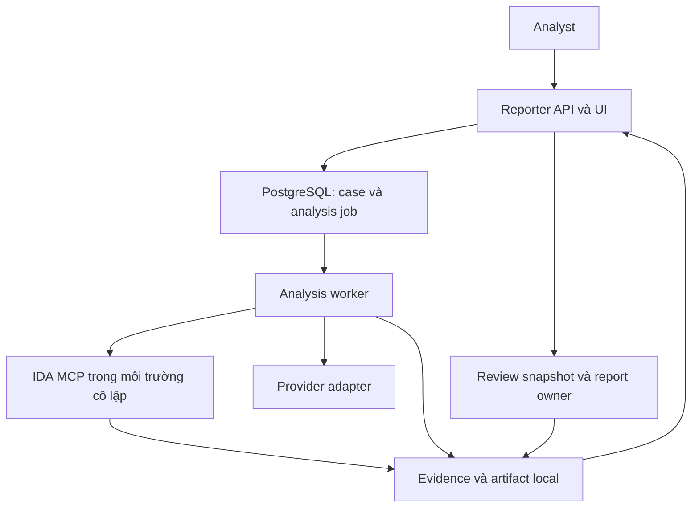

# Triển khai và cập nhật tính năng phân tích mã độc

**Trạng thái:** đặc tả triển khai và runbook cho tính năng mới; chưa phải xác nhận
Reporter đã có server mode, xác thực người dùng, provider adapter hoặc IDA worker.
Hiện trạng được đối chiếu ngày 08/10/2026 với Reporter Pro **2.3.1**, commit
[`1d56f5e46e60814f7a26a2bb81f20008d2b3dfa4`](https://github.com/Eyblcat12/Reporter4CA-/commit/1d56f5e46e60814f7a26a2bb81f20008d2b3dfa4).

Tài liệu này là nơi cập nhật duy nhất cho triển khai, vận hành và nâng cấp luồng
**mẫu → IDA MCP → Codex/Claude/Antigravity → bằng chứng → analyst duyệt → DOCX**.
Cập nhật tại chỗ khi tính năng thay đổi; Git lưu lịch sử. Các đường dẫn/module và
cấu hình ghi **đề xuất** chỉ được tạo khi bước triển khai tương ứng bắt đầu.

## 1. Phạm vi và tài liệu cần dùng

MVP xử lý một mẫu PE x86/x64 trong mỗi run, phân tích tĩnh bằng IDA, sử dụng một
provider cho mỗi lần phân tích và xuất theo một Template Pack đã kiểm chứng.
Analyst duyệt kết luận trước khi xuất báo cáo chính thức. Phân tích động, chạy mẫu,
nhiều mẫu phối hợp và triển khai nhiều API instance là các phạm vi bổ sung sau MVP.

| Nội dung | Nguồn quản lý |
|---|---|
| Cài ứng dụng local hiện có | [INSTALL.md](../INSTALL.md) |
| Dependency, phát triển và quality gate | [DEVELOPMENT.md](DEVELOPMENT.md) |
| Version, tag và release artifact | [RELEASING.md](RELEASING.md) |
| Triển khai malware, cập nhật adapter, dữ liệu runtime và rollback | Tài liệu này |
| Mapping, review và publish template | [TEMPLATE_ADMIN_GUIDE.md](TEMPLATE_ADMIN_GUIDE.md), [TEMPLATE_PACKS.md](TEMPLATE_PACKS.md) |
| Di chuyển/khôi phục Studio | [TEMPLATE_STUDIO_MIGRATION_ROLLBACK.md](TEMPLATE_STUDIO_MIGRATION_ROLLBACK.md) |
| Kiểm tra source xuất bản sạch | [testing/clean-source-smoke.md](testing/clean-source-smoke.md) |

Mỗi PR cập nhật mục liên quan trong tài liệu hiện có. Chỉ tạo release note theo
quy ước `docs/releases/vX.Y.Z.md` khi thực sự chuẩn bị release; không tạo thêm
plan, checklist hoặc báo cáo tiến độ riêng cho từng lần sửa.

## 2. Hiện trạng và điều kiện triển khai server

| Thành phần | Có tại baseline | Việc phải hoàn thành trước khi bật luồng malware |
|---|---|---|
| API/UI | FastAPI và React; launcher bind loopback | Server lifecycle, đăng nhập, phân quyền theo case, reverse proxy/TLS |
| Job | Scheduler report trong tiến trình, lịch sử SQLite | Analysis job bền vững, lease/heartbeat, retry có giới hạn, process supervision |
| Tích hợp model | Chưa có adapter cho luồng này | Provider contract, auth lifecycle, capability và policy dữ liệu |
| IDA MCP | Chưa có worker quản lý mẫu/session | Worker cô lập, binding mẫu–IDB–session, tool allowlist, giới hạn tài nguyên |
| Report | Snapshot, orchestrator, profile renderer, Template Pack | Malware payload/validator, semantic, integrity manifest và review snapshot |
| Backup | SQLite, template DOCX và Studio trong backup schema 2 | Case metadata, mẫu, evidence, IDB cần lưu và báo cáo cuối |

Nguồn hiện trạng: [kiến trúc](ARCHITECTURE.md), [runtime](../apps/backend/core/runtime_lifecycle.py),
[scheduler](../apps/backend/core/report_jobs.py), [database](../apps/backend/core/database.py),
[routes](../apps/backend/api/routes.py), [backup](../apps/backend/core/workspace_backup.py).

Các giới hạn ảnh hưởng trực tiếp đến cài đặt:

- `start.bat` phục vụ phiên desktop; đóng tab cuối có thể kết thúc launcher/backend.
  Backend chạy độc lập không mặc nhiên bị ràng buộc tab, nhưng cần service entry
  point và shutdown/drain được kiểm chứng để vận hành liên tục.
- Giữ **một tiến trình API/report owner** trong MVP. Scheduler hiện nằm trong RAM;
  database startup đánh dấu job cũ `PROCESS_INTERRUPTED`, không tự resume. Tăng
  `uvicorn --workers` chưa tạo ra hàng đợi dùng chung.
- CORS không thay thế đăng nhập và phân quyền. Bảo vệ cả API history, download,
  backup/restore và template cũ. Báo cáo malware phải liên kết case/approved snapshot.
  Báo cáo legacy chưa migrate áp dụng quyền workspace/quản trị rõ ràng; thiếu case
  mapping không có nghĩa là được truy cập công khai.
- Giới hạn Preview/Generate hiện là checkpoint hợp tác và RSS backend; không phải
  giới hạn toàn bộ cây tiến trình IDA. Worker cần deadline, memory/CPU budget và
  cơ chế kết thúc đúng process do run sở hữu.
- Template Pack có đường chọn tường minh `rptpack:<packId>:<version>` trong source.
  Một số tài liệu thử nghiệm cũ còn ghi chưa tích hợp. Publish không tự đổi template
  mặc định; dùng routes/runtime và test tại commit triển khai để quyết định hành vi.

## 3. Kiến trúc triển khai được chọn

Giữ Reporter làm điểm quản lý case, review và report. Tách công việc IDA/model khỏi
request HTTP dài và plugin đồng bộ. Mô hình MVP có một API/report owner, một analysis
worker, một IDA worker và hàng đợi PostgreSQL. Chỉ tăng concurrency sau khi đo và
kiểm chứng ownership; chưa cần thêm Redis/Celery chỉ để chạy một worker.



PostgreSQL lưu miền analysis mới; SQLite giữ miền report hiện có trong giai đoạn
chuyển tiếp. Code SQLite hiện gọi `sqlite3` trực tiếp, nên việc chuyển toàn bộ sang
PostgreSQL cần migration/repository riêng. Bridge report dùng outbox bền vững,
idempotency key và receipt liên kết `case_id`, `analysis_snapshot_id`, `report_id`.
Sau khi ghi file phải đọc lại hash và reconcile receipt khi restart; không giả định
hai database và filesystem nằm trong một transaction nguyên tử.

IDA worker nên chạy trong VM hoặc môi trường có ranh giới tương đương, tách khỏi
database, secrets và control plane. Chỉ đưa mẫu vào phân tích tĩnh. Provider worker
nhận phần evidence được case policy cho phép gửi; binary gốc và IDB ở local. Việc
cài Reporter local vẫn có thể phát sinh truyền dữ liệu tới dịch vụ model.

### Cấu trúc code cần mở rộng

Các vị trí sau là **đề xuất**, không phải yêu cầu tạo sẵn toàn bộ cây thư mục:

| Trách nhiệm | Vị trí dự kiến | Quy tắc |
|---|---|---|
| Case, run, evidence, approval, report adapter | `apps/backend/core/malware_analysis/` | Một module theo trách nhiệm thực tế; schema/domain dùng chung |
| API malware | `apps/backend/api/malware_routes.py` | Route riêng nhận snapshot; auth/ACL áp dụng từ server |
| Client IDA MCP | `apps/backend/integrations/ida_mcp/` | Không đặt package cấp backend tên `mcp`, tránh che SDK |
| Provider contract và adapter đang dùng | `apps/backend/integrations/providers/` | Tạo Codex trước; thêm Claude/Antigravity khi triển khai provider đó |
| UI case, evidence, review | `apps/frontend/src/features/malware-analysis/` | Dùng component/hook chung đã có khi phù hợp |
| Cấu hình, lockfile, test | Các vị trí hiện có | Bổ sung đúng contract thay đổi, không tạo bộ công cụ song song |

Không gọi IDA hoặc agent dài hạn trong `plugins/manager.py` hook. Plugin hiện chạy
trong tiến trình ứng dụng; một số lỗi có thể fallback về dữ liệu cũ, không đáp ứng
điều kiện xác nhận một lần phân tích đã hoàn tất.

## 4. Lộ trình triển khai và điều kiện hoàn thành

| Bước | Thực hiện | Điều kiện qua bước |
|---|---|---|
| P0 — Chốt contract | Chọn template pilot, SDK/CLI/IDA/MCP và auth mode; thử extension point report | Có một payload tổng hợp render được, evidence kiểm tra được, giữ merge boundary |
| P1 — Nền server | Service lifecycle, auth/ACL, RuntimePaths, health/readiness, secrets | Đóng trình duyệt không dừng service; truy cập chéo case bị chặn; runtime ngoài release |
| P2 — Case và job | Intake/hash, schema/migration, queue, lease, cancellation, audit | Restart không mất metadata; retry không tạo output trùng; cancel chỉ dừng đúng run |
| P3 — IDA | Health/capability, database/session binding, tool allowlist | Mẫu tổng hợp cho kết quả đúng; reconnect không đổi database; timeout thu hồi process |
| P4 — Provider đầu tiên | Codex adapter và account lifecycle | Contract tests và canary đầu-cuối đạt; auth/rate limit có trạng thái xử lý |
| P5 — Review và DOCX | Malware semantics, evidence validator, approval snapshot, report bridge | Báo cáo khớp snapshot/hash, không thiếu mục bắt buộc; analyst duyệt template thật |
| P6 — Provider tiếp theo | Claude, rồi Antigravity qua cùng contract | Mỗi adapter qua cùng gate, có compatibility record và rollback riêng |
| P7 — Nghiệm thu vận hành | Restore, drain/upgrade, retention dry-run, tài nguyên và lỗi | Khôi phục đủ case/artifact; đạt ngưỡng pilot; có người nhận vận hành |

Tất cả bước trên còn là kế hoạch cho tính năng mới. Khi hoàn thành, sửa ngay hàng
tương ứng bằng commit/PR và bằng chứng kiểm chứng; tài liệu vendor hoặc cài package
thành công chưa đủ để đánh dấu pipeline Reporter đã hỗ trợ.

### Giữ ranh giới renderer hiện có

CI hiện chạy [`check_template_studio_merge.py`](../scripts/check_template_studio_merge.py)
với base SHA cho mọi PR. Gate bảo vệ `core/report_generator.py`,
`core/report_orchestrator.py`, `core/report_snapshot.py` và `apps/backend/templates/`.
Không sửa, đổi tên hoặc di chuyển các file này để né gate.

Hướng cần chứng minh ở P0: tạo service/route malware riêng, dùng
`AcceptedReportSnapshot.create` với metadata đã đóng băng và `rows=[]`, truyền
validator malware riêng vào `ReportOrchestrator.prepare`, rồi dispatch profile
renderer bằng callback hoặc service mới. Source cho phép truyền validator và
`report_type` dạng chuỗi; đây là **suy luận thiết kế cần contract test**, chưa phải
luồng đã chạy. Không đi qua asset validator cũ hoặc tạo hostname giả cho mẫu.

Nếu extension point không đủ, ghi blocker và đưa đề xuất contract cho maintainer
review trước PR phụ thuộc; giữ gate hiện hành. Integrity malware phải có verifier
riêng và từ chối `verificationSkipped`, không coi manifest rỗng là báo cáo đạt.

## 5. Chuẩn bị môi trường và cài đặt

### 5.1 Baseline local có thể cài ngay

Dùng source/release đã chọn trong một thư mục riêng. Theo [INSTALL.md](../INSTALL.md),
baseline hướng Windows; Python chuẩn của repo là 3.12, Node/npm theo
[package.json](../apps/frontend/package.json) và các version file của repo.

Từ root của source checkout:

```powershell
.\setup.bat -Development
powershell -ExecutionPolicy Bypass -File .\scripts\start-reporter.ps1 -Development
```

Gói Windows prebuilt đã kiểm checksum dùng `setup-prebuilt.bat`, sau đó
`start.bat`; không cần Node trên máy chạy, nhưng cài Python dependency vẫn cần
package index hoặc nguồn package đã chuẩn bị. Đây là bước kiểm chứng baseline
local, chưa cài server/IDA/provider. `start.bat` không chuyển tiếp tham số
development; dùng trực tiếp script như ví dụ.

### 5.2 Cài bản server sau khi P0–P5 đạt

1. Chọn OS/phiên bản được nhóm kiểm thử: ưu tiên baseline Windows trước; xác minh
   riêng IDA/decompiler/idalib, license và tài nguyên trên host worker. Không suy ra
   Windows Server hay Linux đã được hỗ trợ chỉ từ test Windows desktop.
2. Cài release bất biến vào `C:\Reporter\releases\<release-id>`. Tạo tài khoản
   service riêng; thiết lập reverse proxy/TLS và ACL. API chỉ nghe interface nội bộ.
3. Tạo PostgreSQL/schema analysis, bật migration theo thứ tự đã review. Một report
   owner duy nhất quản lý SQLite. Kiểm tra quyền và capacity của các runtime root.
4. Đăng ký IDA worker, kiểm tra tool/capability và sample binding bằng fixture.
   Tạo provider connection thuộc đúng user/service identity và kiểm tra auth.
5. Cài Template Pack pilot bằng version/hash cụ thể, validate với malware fixture,
   review bố cục thật và publish. Chưa thay template mặc định của báo cáo CA.
6. Cấu hình service manager cho API/worker: working directory cố định, environment
   tường minh, restart có backoff, stop nhận job mới và chờ drain có deadline.
7. Chạy canary ở mục 10; chỉ chuyển hệ thống sang nhận case thật khi readiness đạt
   và đã thử restore. Ghi release, schema, worker/model/template version đã duyệt.

Service entry point, file cấu hình server, migration command, drain command và
installer tương ứng **chưa tồn tại trong baseline**. PR P1/P2 phải bổ sung phần
thực thi và cập nhật mục này bằng lệnh đã chạy thực tế. Không dùng một lệnh Uvicorn
mở ra LAN làm bằng chứng hoàn tất triển khai server.

### 5.3 Contract cấu hình server cần bổ sung

| Nhóm cấu hình đề xuất | Yêu cầu validation |
|---|---|
| Server mode và public origin | Tắt phụ thuộc launcher; origin/host rõ ràng; auth sẵn sàng trước nhận case |
| RuntimePaths | Absolute path, writable đúng service, tách source/secrets, chặn path traversal |
| Analysis database và report owner | Schema tương thích, một owner, lease/fencing hoạt động |
| Worker/IDA | Executable/version, capability, process limit, deadline và tool allowlist |
| Sample intake | Kiểu file được hỗ trợ, giới hạn bytes/quota, hash và đường dẫn do server cấp |
| Provider connection | Owner, auth mode, secret reference, model/capability; không chứa token trong UI |
| Case policy và retention | Dữ liệu được gửi, output bắt buộc, quota và thời hạn theo từng loại artifact |

Đây là các trường logic, chưa phải tên biến môi trường có hiệu lực. Cập nhật
`.env.example` và parser cùng PR khi đặt tên chính thức. Setup hiện giữ `.env` cũ;
upgrade phải so sánh và bổ sung cấu hình có kiểm soát, không giả định setup tự merge.
`AUTO_REPORT_ALLOW_CUSTOM_PATHS` hiện có không tự di chuyển mọi data/template/cache
ra ngoài repo; P1 phải áp dụng `RuntimePaths` tới toàn bộ nơi ghi file.

## 6. Xác thực Codex, Claude, Antigravity và MCP

Tách **đăng nhập Reporter**, **kết nối provider** và **quyền MCP**. Mỗi connection
lưu ID, owner, mode, capability và trạng thái; credential thuộc secret store hoặc
runtime native chính thức. Không lưu token vào localStorage, prompt, log, Git hoặc
thư mục agent được phép đọc. Người duyệt luôn lấy từ session backend đã xác thực.

| Provider | Đường tích hợp đề xuất | Điều kiện vận hành |
|---|---|---|
| Codex | SDK `openai-codex`/app-server đã pin; ưu tiên stdio local | Native ChatGPT login/device code qua API chính thức hoặc API auth; runner quản lý credential, Reporter quản lý connection |
| Claude | SDK/API cho worker tổ chức; native CLI nguyên bản cho phiên user riêng | Không dùng subscription token của một người làm API backend chung; native user tự đăng nhập theo cơ chế được hỗ trợ |
| Antigravity | SDK `google-antigravity`/API cho backend | Xác minh `LocalAgentConfig`, auth và MCP của bản pin; native handoff là phiên analyst tự khởi tạo, không lấy cached OAuth để nhúng vào Reporter |
| IDA MCP | Client nối endpoint local/nội bộ được quản lý | Provider auth thành công không thay thế MCP readiness, tool permission hoặc IDA session binding |

Nguồn chính thức: [Codex auth][codex-auth], [SDK][codex-sdk], [app-server][codex-server];
[Claude authentication/usage conditions][claude-legal], [Agent SDK][claude-sdk];
[Antigravity SDK][agy-sdk] và [terms][agy-terms]. Kiểm tra lại tài liệu và điều kiện
của mode chọn dùng khi chốt mỗi release.

Provider contract dùng chung cần các hành vi: đọc trạng thái connection, bắt đầu
auth theo capability, bắt đầu run, nhận event/result, cancel, kiểm tra khả năng
resume và logout. Chỉ quảng bá mode đã được adapter kiểm chứng; không giả định mỗi
nhà cung cấp đều có OAuth nhúng, device flow hoặc refresh API giống nhau.

Trạng thái tối thiểu: `ready`, `needs_auth`, `rate_limited`, `unavailable`, `error`.
Retry theo budget và thời điểm cho phép; không tự đổi tài khoản/provider khi chưa
có policy. Ngắt connection tại Reporter luôn chặn job mới và xử lý run hiện tại
theo lifecycle đã chọn. Logout/revoke upstream chỉ thực hiện khi provider/auth mode
hỗ trợ; ngắt connection không tự đồng nghĩa thu hồi API key.

Với [Claude headless][claude-headless], chạy trong workspace được kiểm soát để
không tự nạp hooks/MCP config từ input. Nếu dùng `--bare`, chọn auth tương thích;
không áp dụng mode đó cho subscription OAuth. Với [Antigravity headless][agy-headless],
exit code 0 có thể đi kèm tool bị từ chối: kiểm tra terminal status, schema và tool
receipt bắt buộc trước khi báo run thành công.

## 7. Contract dữ liệu, IDA và báo cáo

### 7.1 Case, run và evidence

Mỗi mẫu có SHA-256 và kích thước được tính từ bytes đã nhận. Mỗi run gắn `case_id`,
sample hash, recipe/schema version, provider connection/model, adapter/runtime
version, IDA/MCP version, template identity và policy snapshot. Retry của cùng
request dùng idempotency key; lần analyst chủ động phân tích lại tạo run mới.

Evidence tối thiểu có ID, sample hash, tool/version, thời điểm, IDA session/database
revision, function/RVA hoặc offset, nội dung quan sát và artifact hash. Kết luận
tham chiếu evidence ID, tách quan sát trực tiếp, suy luận và phần chưa kiểm chứng.
Không ghi hành vi động như sự kiện đã xảy ra khi chỉ có phân tích tĩnh.

Luồng trạng thái: `queued` → `triaging` → `collecting` → `analyzing` → `validating`
→ `awaiting_analyst` → `approved`. Nhánh lỗi gồm `needs_auth`, `rate_limited`,
`cancel_requested`, `cancelled`, `timed_out`, `failed`, `partial`; lưu stage/attempt
để phục hồi đúng bước. `partial` không được tự chuyển thành kết luận mẫu sạch.

Worker nhận lease kèm fencing token. Khi mất lease, worker cũ không được promote
artifact hoặc ghi kết quả thắng worker mới. Output attempt nằm trong thư mục riêng,
chỉ publish sau validation; cancellation giữ evidence đã hợp lệ và dọn tài nguyên
tạm thuộc run, không xóa sample hay database của run khác.

### 7.2 IDA MCP

- Pin IDA, decompiler/idalib và [IDA MCP][ida-mcp] thành một bộ tương thích. Kiểm tra
  license/capability thực tế theo [Hex-Rays idalib][idalib].
- Mỗi run dùng working IDB/session riêng. Khi mở, reconnect và trước thao tác quan
  trọng, kiểm tra sample hash/database identity; truyền database/session tường minh
  theo schema tool của bản MCP đã pin.
- Allowlist tool theo recipe; tool mới xuất hiện sau update không tự có quyền.
  Recipe static không cấp debugger hoặc Python/shell tùy ý chỉ vì MCP cung cấp nó.
- Supervisor theo dõi cả worker persistent. Đóng client/session có thể chỉ detach;
  cleanup phải xác nhận process/IDB owner, không tìm mọi process IDA rồi kill.
- Text/strings/comment lấy từ mẫu là dữ liệu không tin cậy, không được thay system
  instruction, cấu hình tool, đường dẫn output hoặc chính sách truyền dữ liệu.

### 7.3 Đóng băng kết quả để tạo DOCX

Luồng đề xuất: **ApprovedAnalysisSnapshot → malware adapter → AcceptedReportSnapshot
→ ReportOrchestrator.prepare → PreparedReportSnapshot → profile renderer → kiểm
toàn vẹn → preview cuối → export**. Snapshot chứa nội dung đã duyệt hoặc reference
bất biến kèm hash mà worker xác minh lại trước khi render.

Report manifest phải đối chiếu mẫu, finding, IOC và evidence với phần thật sự được
render. Không bỏ mục bắt buộc khi model thiếu dữ liệu; biểu diễn thiếu bằng chứng
và yêu cầu review. Schema JSON chỉ kiểm hình dạng dữ liệu, không chứng minh nhận
định đúng. Các renderer code block, figure và repeat theo function/sample cần kiểm
tra riêng; chỉ thêm tên semantic chưa làm renderer hỗ trợ chúng.

Giữ mẫu khách hàng gốc theo hash; tạo normalized version/mapping mới, validate và
review rồi publish version mới. Dynamic header/footer và bảng merge phức tạp phải
qua pilot riêng; baseline anchor discovery không đủ để hứa giữ đúng mọi mẫu Word.

Nếu có bước cập nhật field/TOC hoặc chuyển đổi tài liệu, phải thực hiện trước khi
tính hash artifact và duyệt preview cuối. Không dùng Word COM chạy unattended làm
nền server mặc định; [Microsoft không hỗ trợ kiểu tự động hóa Office đó][office].
Chọn cơ chế render/field update được kiểm chứng, hoặc quy trình analyst hoàn thiện
trên desktop rồi nhập lại artifact đã hash/duyệt.

## 8. Bố trí file và quy tắc không tạo file rác

### 8.1 Ranh giới source và runtime

Sau khi `RuntimePaths` được triển khai, bố trí tham khảo như sau. Chỉ tạo thư mục
khi thực sự có dữ liệu; các đường dẫn là ví dụ, không phải vị trí đã được baseline
tự nhận biết.

| Loại | Vị trí tham khảo | Vòng đời |
|---|---|---|
| Code/dependency của release | `C:\Reporter\releases\<release-id>` | Giữ bản đang chạy và bản rollback đã duyệt |
| Mẫu gốc | `D:\ReporterData\cases\<case-id>\samples\<sha256>` | Giữ theo policy case; không sửa bytes gốc |
| Evidence và IDB cần lưu | `D:\ReporterData\cases\<case-id>\runs\<run-id>` | Theo manifest, approval và policy lưu trữ |
| Báo cáo đã duyệt | `D:\ReporterData\reports\<report-id>` | Artifact/hash bất biến, liên kết snapshot |
| File làm việc tạm | `D:\ReporterData\work\<run-id>\<attempt-id>` | Thu hồi sau khi terminal, hết lease và publish xong |
| Cache/preview | `D:\ReporterData\cache` | TTL/quota, không giữ bản duy nhất của evidence/report |
| Logs và backup | `D:\ReporterData\logs`, `D:\ReporterData\backups` | Rotation/retention riêng từng nhóm |
| Credential/native profile | Secret store hoặc thư mục ACL riêng | Ngoài case/workspace đọc bởi agent; theo owner/runtime |

Baseline hiện ghi nhiều dữ liệu tại `apps/backend/data` và template tại backend
bundle. Phải migration/readback trước khi đổi root; không xóa thư mục cũ cho tới
khi đối chiếu đủ hash và tham chiếu, đã có backup và hết thời gian rollback.

### 8.2 Quy tắc khi phát triển

- Một chức năng có một nơi quản lý chính. Dùng script setup/check/release/clean-source
  đã có; không thêm script chỉ đổi tên hoặc wrapper không có trách nhiệm mới.
- Không tạo sẵn adapter chưa triển khai, file TODO rỗng, bản `final_v2/final_v3`,
  file debug hoặc report output cạnh source. Ghi việc còn lại trong PR/tài liệu này.
- Config mẫu dùng placeholder; manifest/lockfile thay đổi cùng code tiêu thụ chúng.
  Fixture mới phải có test tham chiếu và mục tiêu regression rõ ràng.
- Dùng temporary directory/context manager hoặc `try/finally` cho dữ liệu trung gian.
  Chỉ copy mẫu/IDB khi cần isolation/version; không nhân bản toàn bộ case ở mỗi step.
- Nếu giữ diagnostic khi lỗi, gắn run/owner, mục đích và điều kiện hết hạn. Bằng chứng
  lỗi chưa điều tra xong vẫn là artifact có giá trị.

`.gitignore` mô tả file không đưa vào source control; **ignored không có nghĩa là
được phép xóa**. Giữ template/fixture/golden có mục đích, kể cả DOCX/JSON/ZIP. Không
thêm ignore toàn cục theo extension để che output; dùng namespace output cụ thể.
Tham khảo [.gitignore](../.gitignore) và [cleanup checklist](PROJECT_CLEANUP_CHECKLIST.md);
các số liệu/đường dẫn máy trong checklist cũ là khảo sát lịch sử, không phải danh
sách được phép xóa trên máy hiện tại.

### 8.3 Cleanup runtime cần đáp ứng gì

Cleaner chỉ xử lý namespace nó sở hữu, theo thứ tự: **dry-run → kiểm tra lại
manifest/references/lease → quarantine có phục hồi → xóa sau thời hạn policy**.
Giải quyết đường dẫn thật và chặn symlink/path traversal trước thao tác. Kế hoạch
thay đổi, job còn active, artifact còn được approval/report tham chiếu hoặc case
đang hold thì dừng; mặc định chưa có policy nghĩa là không tự xóa case data.

Không áp dụng TTL preview cho sample, IDB, evidence, approved snapshot hoặc final
report. Không xóa riêng WAL/SHM khi database đang dùng. Không dọn file untracked có
nội dung duy nhất để ép `git status` sạch. Không dùng lệnh xóa rộng như
`git clean -fdx` hoặc quét xóa mọi DOCX/JSON/ZIP.

Tái sử dụng đúng cơ chế hiện có:

- Preview registry quản lý cache/lease riêng; multi-process cần ownership phối hợp.
- Studio retention có dry-run và quarantine phục hồi; không dùng cho case malware.
  Quarantine trên cùng ổ chưa giải phóng dung lượng ổ.
- Automatic backup chỉ prune nhóm `reporter-pro-auto-*.zip` nó sở hữu sau backup mới
  thành công; manual backup và checkpoint migration có policy riêng.
- `validate_clean_source.py` kiểm source **export**, không kiểm working checkout.
  Dùng `smoke-clean-source.ps1`, không xóa `.git`, data hay môi trường đang dùng để
  làm validator pass. Script smoke giữ diagnostic khi lỗi và dọn workspace thành công.

Nguồn: [preview registry](../apps/backend/core/preview_artifacts.py),
[Studio retention](../apps/backend/core/template_workspace_retention.py),
[scheduled backup](../apps/backend/core/scheduled_backup.py),
[source validator](../scripts/validate_clean_source.py).

## 9. Quy trình cập nhật một tính năng

Mỗi thay đổi đi qua một PR có mục tiêu, contract bị ảnh hưởng, migration nếu có,
test có ý nghĩa và đường rollback. Khi thêm behavior, cập nhật code, cấu hình mẫu,
dependency lock và đúng mục tài liệu trong cùng thay đổi; không sinh bản hướng dẫn
mới chỉ vì phiên bản khác.

| Loại thay đổi | Phần cần cập nhật | Kiểm chứng bắt buộc |
|---|---|---|
| Provider mới | Adapter, capability/auth, connection UI, dependency cần dùng | Events/result, auth expiry, rate limit, cancel, schema lỗi, canary |
| SDK/CLI/model mới | Pin/lock và compatibility record | Tool surface, terminal result, resume/cancel, evidence quality; không chỉ prompt chào |
| IDA/MCP mới | Version, schema/tool mapping, binding và process lifecycle | Đúng mẫu/IDB, reconnect, timeout, tool mới mặc định bị chặn |
| Recipe/prompt | Recipe version, output/evidence requirements | Finding được chứng minh; ghi giới hạn phân tích; so sánh baseline |
| Payload/schema mới | Domain validator, API, persistence migration, adapter/report signature | Đọc dữ liệu cũ, invalid input, migration/restore và hash identity |
| Semantic/template mới | Profiles/runtime/renderer và schema thực sự thay đổi | Fixture malware, preview cuối, integrity và regression template hiện có |
| Auth/ACL/storage | Guard của cả endpoint cũ và mới, paths/secret references | Truy cập chéo case, restart/drain, path boundary, backup/restore |

### Ví dụ: thêm Claude sau Codex

Triển khai adapter Claude vào contract chung và UI capability, không copy toàn bộ
pipeline Codex. Chọn SDK/API hoặc native connection theo mục 6; thêm dependency/lock
chỉ cho mode được triển khai. Chạy fixture events dùng chung, thử auth lỗi/MCP thiếu
tool và canary bằng cùng template. Chỉ bật connection sau khi có compatibility
record; code evidence/review/report tiếp tục dùng payload chuẩn.

### Ví dụ: bổ sung `malware_analysis` và bảng function

API malware riêng nhận snapshot; không gửi qua workflow asset cũ. Kiểm các điểm
đang có registry/validator sau và chỉ sửa nơi thật sự tham gia nhánh mới:

- `api/models.py`, `core/template_schema.py`, `core/template_profiles.py` và
  `config/template_packs/layout.schema.json` cho report type/semantics.
- `core/template_pack_runtime.py`, `core/template_pack_validation.py`,
  `core/profile_renderer.py` cho payload, fixture và renderer thực tế.
- `components/export/ReportTypeSelector.jsx`, `components/configure/TemplateManager.jsx`,
  `features/template-studio/NewTemplateWorkspace.jsx`, `WorkspaceManagerDialog.jsx`,
  `semanticCatalog.js`, `validationFixture.js` và `hooks/useReporter.jsx` ở frontend
  cho loại báo cáo, mapping và snapshot gửi lên API.

`api/models.py::ReportType` đang được nhiều request dùng chung. Dùng enum/request
riêng cho malware, hoặc từ chối tường minh type mới tại mọi endpoint report legacy
như `/generate`, `/preview-docx`, `/report-jobs`, `/preview-jobs`. Legacy renderer
có fallback type không nhận biết về `full`, nên validation ở boundary là bắt buộc.
Dropdown malware phải dispatch route mới; thêm ID vào danh sách là chưa đủ.

Registry `ReportType` trong `core/report_generator.py` thuộc đường legacy được
bảo vệ; không thêm type vào đó chỉ để đồng bộ một dropdown. Nhánh malware phải có
registry/dispatch nhất quán riêng hoặc dùng extension đã được chốt ở P0. Cần test
chứng minh sample không bị đếm là server/client trong history/dashboard.

Chỉ đổi `manifest.schema.json`, `mapping.schema.json` hoặc `validation.schema.json`
nếu contract của chúng đổi. Published pack/version và approved snapshot giữ nguyên;
mapping/renderer mới tạo version mới. Không cập nhật golden tự động để làm test qua.

## 10. Kiểm thử và canary

### Các lệnh hiện có

Từ repo root, sau khi cài development dependency:

```powershell
powershell -ExecutionPolicy Bypass -File .\scripts\check.ps1
apps\backend\.venv\Scripts\python.exe -m unittest -v tests.test_report_snapshot tests.test_profile_renderer tests.test_template_pack_runtime tests.test_report_integrity
git diff --check
git status --short
git diff --cached --name-status
```

Lệnh unittest là ví dụ chạy nhóm liên quan trong lúc phát triển; không cần chạy lại
sau full gate vừa đạt nếu không có thay đổi mới. `check.ps1` liệt kê module test
tường minh, nên test mới cần được đưa vào gate phù hợp để CI thật sự chạy nó.

Kiểm protected diff bằng **base SHA thực tế của PR**:

```powershell
$BaseSha = Read-Host "Base commit SHA của PR"
apps\backend\.venv\Scripts\python.exe scripts\check_template_studio_merge.py --base-ref $BaseSha
```

`check.ps1` không thay thế lần kiểm có `--base-ref`, và không chạy E2E. E2E với API
thật, từ root, trong PowerShell dành cho kiểm thử:

```powershell
$env:REPORTER_E2E_MANAGED_API = "1"
$env:REPORTER_TEST_PYTHON = (Resolve-Path "apps\backend\.venv\Scripts\python.exe").Path
Push-Location apps\frontend
try {
    npx playwright install chromium
    if ($LASTEXITCODE -ne 0) { throw "Playwright install failed" }
    npm run test:e2e -- --retries=0
    if ($LASTEXITCODE -ne 0) { throw "E2E failed" }
} finally {
    Pop-Location
}
```

Lệnh trên kiểm workflow hiện có; PR malware phải bổ sung case E2E tương ứng. Với
PR chỉ sửa tài liệu, kiểm link/path, tính đúng của lệnh và diff là đủ cho phần
review tài liệu; giữ CI/gate của repo, không bỏ qua chúng.

### Gate mới cho malware

Contract tests dùng fixture tổng hợp/recorded events đã bỏ secrets. Test lỗi thật
sự ảnh hưởng kết quả: wrong-sample binding, stale lease, tool bị từ chối, mất stream,
auth hết hạn, timeout/cancel, output thiếu evidence, approval cũ, report retry trùng
và restore thiếu artifact. Không khóa test theo từng câu văn do model sinh ra.

Canary chạy ở worker riêng với bộ mẫu được duyệt và template pilot: intake → IDA
→ evidence → analysis JSON → validate → analyst review → DOCX → download/readback.
So sánh đúng mẫu, đủ finding/evidence, các mục bắt buộc, không còn token template,
integrity verified, hash preview/export, thời gian, RAM và mức sử dụng model.

Ngưỡng thời gian/RAM/chi phí và policy dữ liệu phải được chốt theo pilot trước
production. Chưa có benchmark malware được chạy để suy ra ngưỡng từ số dòng CA.
Test sáu report type cũ, backup và template vẫn phải đạt khi nhánh mới được bật.

## 11. Đóng gói và nâng cấp hệ thống

### 11.1 Chuẩn bị release có thể tái lập

Theo [RELEASING.md](RELEASING.md), chọn version, dùng `set-version.ps1 -Version`
với version đã duyệt, cập nhật changelog/release note và commit metadata. Các số
version minh họa trong tài liệu cũ không phải version được tự động chọn cho lần mới.
Giữ Python dependency có hash và `npm ci`; nâng SDK thì review manifest/lock cùng PR.

Build từ checkout sạch của **đúng commit chuẩn bị phát hành**, với dependency mới
cài theo lockfile. `check.ps1` build frontend vào `.verification` rồi dọn; nó không
làm mới `apps/frontend/dist`. `create-release-artifacts.ps1` lấy source từ `-Ref`,
nhưng lấy VERSION và frontend dist từ working tree; vì vậy cần build lại trên cùng
checkout, không đổi ref hoặc source giữa các bước.

Ví dụ chuẩn bị artifact local, từ root checkout đã commit và đã qua quality gate:

```powershell
$ReleaseRef = (git rev-parse HEAD).Trim()
if ($LASTEXITCODE -ne 0) { throw "Cannot resolve release commit" }
if (git status --porcelain) { throw "Release checkout must be clean" }
powershell -ExecutionPolicy Bypass -File .\scripts\verify-release.ps1
if ($LASTEXITCODE -ne 0) { throw "Release metadata failed" }
Push-Location apps\frontend
try {
    npm ci
    if ($LASTEXITCODE -ne 0) { throw "npm ci failed" }
    npm run build
    if ($LASTEXITCODE -ne 0) { throw "Production build failed" }
} finally {
    Pop-Location
}
powershell -ExecutionPolicy Bypass -File .\scripts\smoke-clean-source.ps1 -Ref $ReleaseRef -PythonExecutable python.exe
if ($LASTEXITCODE -ne 0) { throw "Clean-source smoke failed" }
powershell -ExecutionPolicy Bypass -File .\scripts\create-release-artifacts.ps1 -Ref $ReleaseRef
if ($LASTEXITCODE -ne 0) { throw "Release packaging failed" }
```

Smoke kiểm commit/ref, không kiểm thay đổi chưa commit. Script artifact hiện xuất
vào `artifacts/releases/v<version>` với manifest/checksum; đây là output release
được quản lý, không commit lại vào Git. Khi publish dùng workflow tag và
`verify-release.ps1 -RequireTag`. Không di chuyển tag đã phát hành; kiểm remote
thực tế bằng `git remote -v`, không giả định tên remote luôn là `github`.

### 11.2 Cập nhật bản local hiện tại

1. Hoàn tất hoặc hủy job, tạo Workspace Backup từ bản cũ; bảo quản riêng `.env` và
   generated report cần giữ. Backup phải có trước khi code mới mở database cũ.
2. Cài source/prebuilt của release mới trong thư mục riêng theo mục 5.1; đối chiếu
   checksum/manifest và merge cấu hình phù hợp. Giữ nguyên bản cũ để rollback.
3. Dừng instance cũ rồi khởi động bản mới; dùng preview/restore có sẵn để chuyển
   SQLite/template/Studio, không chép riêng database đang ghi.
4. Kiểm `/api/health`, template, lịch sử và một report tổng hợp trước khi chuyển
   người dùng. Generated report đã lưu riêng cần được đối chiếu đường dẫn/hash;
   không giả định restore Workspace Backup sẽ mang chúng sang.

API hiện có trong [routes](../apps/backend/api/routes.py):
`GET /api/system/backup`, `POST /api/system/restore/preview`,
`POST /api/system/restore`. Preview nhận archive ở field `backup`; restore gửi lại
đúng archive cùng `confirmationToken` được preview trả về. Archive thay đổi phải
preview lại. Restore từ chối schema mới hơn code; nếu cần rollback schema, dùng
backup trước upgrade và bảo toàn thay đổi phát sinh sau đó theo mục 12.

### 11.3 Runbook upgrade sau khi đã có server mode

1. **Inventory:** ghi release/commit hiện tại, schema hai database, worker/SDK/CLI,
   recipe, pack version/hash và cấu hình bật tính năng; chọn bản rollback tương thích.
2. **Drain:** dừng cấp job mới; để run hoàn tất hoặc checkpoint theo contract đã
   kiểm chứng. Chặn thao tác thay template/restore và writer khác trong maintenance.
   Dừng hẳn report owner cũ trước khi migrate hoặc mở cùng workspace bằng code mới.
3. **Backup:** tạo bộ backup nhất quán theo mục 12, kiểm hash và thử đọc manifest.
   Giữ cấu hình/secret references; credential theo secret-store recovery riêng.
4. **Prepare:** cài release mới vào thư mục mới với venv sạch. Setup tái dùng venv
   có thể giữ package dư, nên không dùng venv cũ làm bằng chứng tái lập dependency.
5. **Migrate:** thử migration trên bản sao backup; kiểm dữ liệu và schema compatibility,
   rồi áp dụng một lần có kiểm soát vào production. Ghi migration checkpoint.
6. **Canary:** dùng bản sao database và namespace artifact riêng, khởi động worker
   bản mới, xác minh readiness và chạy pipeline tổng hợp. Nếu kiểm dữ liệu live,
   phải dừng owner cũ và mọi writer trước; không để hai owner cùng chạm SQLite/cache.
7. **Switch:** chuyển service sang release mới; nhận job mới khi queue/DB/worker,
   auth, paths và renderer đều sẵn sàng. Run cũ giữ version được pin của nó.
8. **Observe:** theo dõi queue age, lease/heartbeat, orphan process, MCP timeout,
   auth/rate limit, schema/evidence error, artifact integrity, dung lượng và chi phí.
9. **Close:** đối chiếu receipts/artifacts, ghi kết quả vào release record; dọn
   staging do deployment sở hữu sau thời hạn. Giữ bản rollback và backup đã chọn.

Nâng provider/IDA riêng áp dụng cùng drain/canary/switch, không thay executable,
MCP tool mapping, model hoặc prompt giữa một run. Compatibility record của release
phải có cột Reporter/schema, adapter, SDK/CLI, IDA/decompiler, MCP, model, template,
auth mode, ngày/test và kết quả. Khả năng chưa kiểm chứng ghi `unverified` và chưa
được bật production; chỉ ghi `unsupported` khi đã xác định không được hỗ trợ.

## 12. Backup, restore và rollback

Workspace Backup hiện lưu SQLite/template/Studio và ghi
`includesGeneratedReports: false`; không lưu `.env`. Database có thể chứa cấu hình
kết nối đã lưu, nên archive vẫn cần ACL/bảo vệ. Backup này chưa bao phủ sample,
IDB, evidence hoặc final report của miền malware.

Bộ backup malware cần metadata nhất quán của case/run/approval/report receipts,
SQLite report snapshot, PostgreSQL snapshot phù hợp, toàn bộ artifact bytes được
manifest tham chiếu, pack/index/version liên quan và version/schema/hash. Backup
các DB đang ghi bằng cơ chế snapshot hợp lệ; không copy riêng một file DB và bỏ WAL.
Trong MVP nên drain writer để lấy một điểm nhất quán xuyên hai database/filesystem.

Restore vào môi trường tách biệt phải mở được case, xác minh sample/evidence hashes,
đọc approved snapshot, tải report đúng hash và dùng được catalog/pack. Chỉ thấy ZIP
hoặc khôi phục riêng `index.json` chưa đủ. Mục tiêu RPO/RTO và thời hạn giữ backup
phải được owner chốt bằng một lần diễn tập đo thực tế.

### Chọn đường rollback

| Tình huống | Hành động |
|---|---|
| Adapter mới lỗi, schema không đổi | Drain pool mới, ngừng cấp run, dùng lại adapter/runtime đã pin; giữ dữ liệu run lỗi |
| App mới lỗi, schema còn tương thích ngược | Drain, chuyển service về release cũ, health/readback rồi nhận job |
| Migration/IDB mới không đọc được bằng bản cũ | Dừng ghi; restore bộ backup vào môi trường/namespace phục hồi, kiểm đầy đủ trước chuyển |
| Pack/renderer mới lệch bố cục | Chọn pack/renderer version đã duyệt cho report mới; giữ nguyên report/snapshot đã xuất |
| Auth hoặc MCP mất quyền | Chuyển `needs_auth`/`unavailable`, phục hồi đúng owner/capability; không retry vô hạn |

Không tự downgrade database hoặc overwrite evidence mới bằng snapshot cũ. Nếu
restore mốc trước upgrade, liệt kê và bảo toàn run/artifact phát sinh sau mốc đó;
reconcile/replay có kiểm soát với idempotency thay vì mất dữ liệu im lặng. Resume
chỉ dùng khi runtime/IDB/session/schema tương thích đã được kiểm tra; trường hợp
khác tạo run mới từ mẫu gốc, giữ provenance của run trước.

`AUTO_REPORT_TEMPLATE_PACKS=0` là cô lập Studio/pack khi cần maintenance, không phải
fallback malware sang report `full`. Khôi phục trạng thái cấu hình đã chốt sau
bảo trì; nhánh yêu cầu pack phải báo unavailable nếu pack flow đang tắt.
Sửa `.env` cần restart có drain để tiến trình nạp cấu hình; baseline không tự hot
reload file cấu hình khi đang chạy.

## 13. Checklist trước khi merge và bàn giao

- [ ] PR chỉ chứa source/config/lock/test/docs cần cho thay đổi; không có credential,
  mẫu khách hàng, IDB, output report, transcript, log hoặc bản tài liệu trùng.
- [ ] Phần có sẵn và phần đề xuất được đánh dấu đúng; lệnh mới có triển khai và đã
  chạy trước khi được ghi là hướng dẫn cài đặt có thể dùng.
- [ ] Merge boundary giữ nguyên; test mới được đưa vào gate; CI hiện hành đạt.
- [ ] Có auth/ACL cho cả luồng report cũ lẫn mới, sample/session binding, lease và
  cancellation đúng owner; không báo thành công khi tool/evidence bắt buộc thiếu.
- [ ] Template thật qua mapping/review; snapshot, integrity, preview/export hash
  khớp; các báo cáo CA/IR hiện có vẫn hoạt động.
- [ ] Có compatibility record, ngưỡng pilot, drain/canary, backup/restore và đường
  rollback đã thực hành; runtime/cleanup có owner, namespace, lease và retention.
- [ ] Người nhận vận hành biết nơi xem health/job/audit, cách xử lý auth hết hạn,
  thiếu dung lượng, IDA treo và khi nào chuyển về release trước.

Đối với PR chỉ thêm tài liệu này, phạm vi nghiệm thu là nội dung, liên kết, lệnh
và diff tài liệu. Các gate runtime ở trên thuộc PR triển khai tính năng; chưa được
đánh dấu đạt chỉ vì runbook đã được viết.

## Tài liệu nhà cung cấp

Các nguồn dưới đây dùng để chọn cơ chế chính thức. Pin phiên bản và kiểm lại nguồn
trong lần update; hành vi của vendor không thay thế integration test của Reporter.

| Thành phần | Nguồn |
|---|---|
| Codex | [Authentication][codex-auth], [SDK][codex-sdk], [app-server][codex-server] |
| Claude | [Usage conditions][claude-legal], [Agent SDK][claude-sdk], [headless][claude-headless] |
| Antigravity | [SDK][agy-sdk], [terms][agy-terms], [headless][agy-headless] |
| IDA | [IDA MCP][ida-mcp], [Hex-Rays idalib][idalib] |
| DOCX trên server | [Microsoft Office automation considerations][office] |

[codex-auth]: https://learn.chatgpt.com/docs/auth
[codex-sdk]: https://learn.chatgpt.com/docs/codex-sdk
[codex-server]: https://learn.chatgpt.com/docs/app-server
[claude-legal]: https://code.claude.com/docs/en/legal-and-compliance
[claude-sdk]: https://code.claude.com/docs/en/agent-sdk/overview
[claude-headless]: https://code.claude.com/docs/en/headless
[agy-sdk]: https://antigravity.google/docs/sdk/overview/
[agy-terms]: https://antigravity.google/terms
[agy-headless]: https://antigravity.google/docs/cli/headless/
[ida-mcp]: https://github.com/mrexodia/ida-pro-mcp
[idalib]: https://docs.hex-rays.com/core/idalib/getting-started
[office]: https://support.microsoft.com/en-us/visio/considerations-for-server-side-automation-of-office
