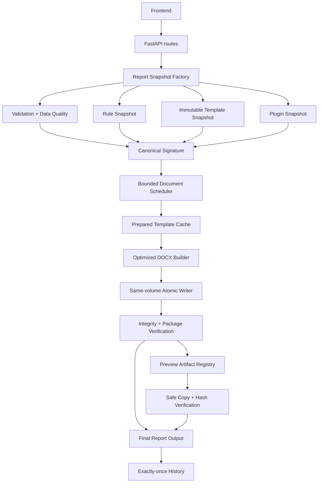
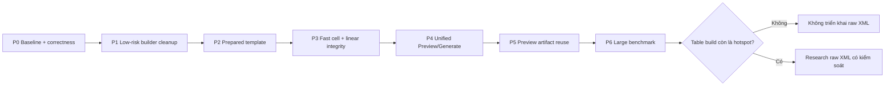

# Kế hoạch triển khai tối ưu Preview và Generate DOCX

> **Trạng thái:** Phase 0–5 đã tích hợp; Preview Job/Cache đạt gate 10 trial và được bật mặc định cho local/team, có feature flag rollback
> **Phạm vi:** Reporter Pro cho cá nhân và team nội bộ  
> **Mục tiêu ưu tiên:** Tăng tốc nhưng giữ nguyên template, nội dung, finding, evidence và khả năng quay lại engine hiện tại  
> **Tài liệu kiến trúc gốc:** `docs/PERFORMANCE_OPTIMIZATION_PLAN.md`  
> **Cập nhật:** 03/08/2026

## Tiến độ triển khai

### Phase 0 — hoàn tất ngày 31/07/2026

- Đã bổ sung fixture hiệu năng xác định theo seed cho bốn profile:
  `clean`, `mixed`, `finding_heavy`, `long_notes`.
- Đã bổ sung benchmark runner cô lập từng trial bằng process mới, ghi product
  latency, audit latency, CPU, peak RSS, kích thước đầu ra, hash fixture/template
  và trạng thái feature flag.
- Đã gắn timing nội bộ vào các phase dựng DOCX mà không ghi hostname, note hoặc
  dữ liệu nhạy cảm vào metrics.
- Đã hoàn thiện coverage runtime cho queue wait, snapshot/validation, plugin,
  template preparation, generator, save/ZIP, Word field update, post-plugin
  integrity và tổng thời gian artifact; metrics mặc định tắt bằng feature flag.
- Đã thêm aggregate `tableCreate` và `tableStyle` theo loại bảng, không tạo event
  theo từng row/cell và không thay đổi nội dung hay định dạng report.
- Đã khóa semantic integrity cho `Tracking.csv`, `Tracking_2.csv` và sáu report
  type trong quality gate.
- Đã ghi baseline `mixed/full` 50 máy: 5/5 trial đạt, P50 16,22 giây; nút thắt
  `templateTrim` có P50 10,35 giây.
- Đã chạy smoke cuối Phase 0 một trial: 1/1 đạt, đủ 50 asset, 42 finding và 67
  evidence; product latency quan sát 30,71 giây. Smoke này chỉ xác nhận
  instrumentation/integrity, không thay baseline 5 trial và không có P95.
- Đã xác nhận backend test, frontend test và production build đều đạt.

Artifact benchmark được ghi vào `artifacts/benchmarks/` và bị loại khỏi Git theo
mặc định; số liệu đã duyệt được tổng hợp trong `docs/BENCHMARKS.md`.

### Phase 1 — hoàn tất triển khai và đánh giá ngày 03/08/2026

- Đã cache việc nạp module DOCX và loại bỏ lượt định dạng cell/border trùng lặp;
  golden test xác nhận thứ tự OOXML và định dạng Word không thay đổi.
- Đã tích hợp compact-prototype sau feature flag và kiểm thử đủ sáu report type.
- A/B 10 trial cho thấy compact-prototype riêng lẻ làm P50 tăng 4,47% và P95 tăng
  5,16%. Vì không đạt performance gate, flag `AUTO_REPORT_COMPACT_PROTOTYPE`
  được giữ mặc định `0`; legacy prototype vẫn là đường chạy chính.
- Kết luận Phase 1: phần tối ưu ít rủi ro được giữ lại, compact-prototype hoàn
  thiện về correctness nhưng chưa được rollout.

### Phase 2 — hoàn tất và rollout ngày 03/08/2026

- Đã thêm prepared-template compiler/cache theo SHA-256 của bytes template,
  report type và version của compiler/schema.
- Artifact được ghi atomic, kiểm tra ZIP/OOXML/hash/kích thước trước khi dùng;
  entry hỏng tự compile lại và mọi lỗi cache đều fallback về engine cũ.
- Hỗ trợ cache hit sau khi khởi động lại, compile-once khi có request đồng thời,
  LRU theo số entry/dung lượng và startup sweep chỉ trong vùng cache được quản lý.
- Upload template tương thích sẽ warm cache ở background; lỗi warm-up không làm
  upload thất bại.
- A/B cuối cùng 10 trial đạt P50 6.959,978 ms và P95 7.774,972 ms, giảm lần lượt
  khoảng 73,0% và 71,1% so với control 10 trial. Peak RSS P50 chỉ tăng 0,22%.
- Flag `AUTO_REPORT_PREPARED_TEMPLATE` được bật mặc định (`1`). Có thể rollback
  ngay về trim legacy bằng cách đặt flag thành `0`, không cần migrate dữ liệu.

### Phase 3 — hoàn tất và rollout ngày 03/08/2026

- Đã thêm simple-cell classifier bảo thủ: field, hyperlink, content phức tạp,
  merge, nhiều paragraph/run và newline luôn đi đường safe.
- Prototype data row được chuẩn hóa một lần về đúng canonical OOXML của legacy
  trước khi clone; fast path chỉ thay text trên run đã được xác nhận an toàn.
- Đã thêm checkpoint mỗi 25–50 dòng để job có thể nhận cancel và cập nhật tiến
  độ trong lúc dựng DOCX lớn. Batch không được dùng để tuyên bố giảm RAM.
- Integrity verifier tiếp tục index table/heading một lần bằng Counter; không
  quét lại toàn bộ document cho từng asset.
- Golden của sáu report type đạt với fast-cell bật; output A/B 50 và 1.000 máy
  giữ nguyên kích thước và semantic manifest.
- Benchmark `mixed/full` 1.000 máy, 10 trial/nhánh: P50 giảm từ 72.641,318 ms
  xuống 59.007,216 ms (−18,8%); P95 giảm từ 73.371,854 ms xuống 62.954,135 ms
  (−14,2%); report-body P50 giảm 22,9%; peak RSS P50 giảm khoảng 1,7%.
- Flag `AUTO_REPORT_FAST_CELL` được bật mặc định (`1`); đặt thành `0` để rollback
  ngay về safe writer mà không thay đổi dữ liệu hoặc template.

### Phase 4 — hoàn tất và rollout backend ngày 03/08/2026

- Đã tạo snapshot bất biến ở thời điểm API chấp nhận request; rows, metadata, rule,
  template bytes/hash và plugin manifest được pin trước khi job vào hàng đợi.
- Preview và Generate đã dùng chung `ReportOrchestrator`, cùng effective defaults,
  validation, input plugin, rule snapshot, template snapshot, document plugin và
  integrity verification. Hai đường chạy chỉ còn khác policy publish/history.
- Đã bổ sung canonical streaming SHA-256 với Unicode NFC, dict key ổn định, giữ
  nguyên thứ tự row và reject dữ liệu không xác định như `NaN`/`Infinity`.
  `outputName` và audit timestamp không làm thay đổi identity của nội dung.
- Backend trả `X-Request-Signature` và `X-Content-Signature`; parity integration test
  xác nhận cùng input tạo cùng request/content signature ở Preview và Generate.
- Plugin contract có `plugin_id`, `version`, source hash, `cache_identity` và policy
  `deterministic`/`volatile`/`no_store`; plugin chưa khai báo được xử lý bảo thủ.
- Preview và Generate mặc định dùng chung bounded local scheduler một worker. Job
  được phân biệt theo kind, dedup có kiểm soát, terminal transition idempotent,
  cancel/shutdown an toàn và chỉ `completed` sau khi artifact metadata đã sẵn sàng.
- Template đang chọn được pin thành byte snapshot trước queue, nên việc thay template
  trong lúc chờ không thể âm thầm đổi nội dung report đã được chấp nhận.
- Flag `AUTO_REPORT_UNIFIED_SCHEDULER=1` được bật mặc định. Đặt thành `0` để rollback
  ngay về direct-thread compatibility adapter mà không đổi API hoặc migrate dữ liệu.
- Release gate cuối Phase 4 đạt: **202 backend tests**, **40 frontend tests** và
  production build đều thành công.

Phase 4 không thay đổi workflow UI. Phase 5 là checkpoint bắt buộc trước khi đưa
Preview job/artifact reuse lên giao diện vì thay đổi này tác động trực tiếp cách người
dùng hiểu trạng thái `current`, `stale`, `expired` và hành vi Generate từ Preview.

### Phase 5 — tích hợp frontend/backend hoàn tất ngày 03/08/2026, rollout có kiểm soát

- Đã thêm Preview Job API bất đồng bộ: tạo, poll, cancel và tải nội dung; API cũ vẫn
  giữ nguyên làm compatibility fallback.
- Đã thêm managed Preview Artifact Registry với TTL 15 phút, giới hạn entry/byte,
  LRU, startup sweep, integrity SHA-256 và lease/refcount cho download/promotion.
- Cleanup không xóa artifact đang được lease; artifact stale, expired hoặc corrupt
  không được trả như một Preview hợp lệ và API không lộ đường dẫn vật lý.
- Generate job hỗ trợ explicit `previewId`. Khi bật `AUTO_REPORT_PREVIEW_CACHE=1`,
  backend kiểm tra signature/template/plugin policy rồi copy byte-for-byte, xác minh
  SHA-256 và atomic replace; không dùng hard-link và không âm thầm cold-generate nếu
  artifact người dùng chỉ định không còn hợp lệ.
- Report history schema 9 lưu `job_id`, `client_request_id`, request signature,
  source artifact và cache status. `job_id` có unique index; state đi qua
  `queued → running → success/failed/cancelled`, retry terminal là idempotent và
  startup đánh dấu job bỏ dở là `PROCESS_INTERRUPTED`.
- Dashboard không tính `queued/running` vào attempts, recent report hoặc success rate.
- Prototype độc lập có đủ năm trạng thái `generating`, `current`, `stale`, `expired`,
  `failed` tại `docs/reporter-preview-job-prototype.html`; frontend sản phẩm đã nối
  theo feature flag, có fallback API cũ, chống stale race và explicit cancel.
- Release gate trước vòng prewarm đạt: **214 backend tests**, **43 frontend tests**
  và production build thành công.

Frontend chính đã được nối theo cơ chế feature-flag/fallback và có kiểm thử promotion,
stale race, explicit cancel. Benchmark cache-hit Generate 50 máy đạt 73,092 ms và
byte-identical. Profile tái lập xác định cache-miss Preview `full/50` là 28,131 giây,
trong đó prepared-template compile chiếm 19,872 giây. Setup hiện prewarm template;
Preview sau prewarm đạt 7,164 giây, dưới ngưỡng 10 giây.

Development gate tiếp theo đạt 5/5 trial prewarmed với min 7,491 giây, median
7,721 giây và max 7,926 giây. Chưa công bố P95 vì chưa đủ 10 mẫu.
Release gate sau thay đổi đạt **216 backend tests**, **43 frontend tests** và
production build; chạy với `ResourceWarning` hiển thị không còn cảnh báo SQLite.

Release gate cuối gồm 10/10 trial prewarmed đạt integrity và dưới 10 giây:
P50 6.300,499 ms, P95 7.882,863 ms, max 7.926,317 ms. Vì vậy hai flag Preview
được bật mặc định; đặt `AUTO_REPORT_PREVIEW_JOBS=0` hoặc
`AUTO_REPORT_PREVIEW_CACHE=0` vẫn rollback ngay mà không migrate dữ liệu.

## 1. Kết luận kỹ thuật làm cơ sở triển khai

Profile trên template `full` mặc định và `Tracking_2.csv` xác nhận:

- `_trim_template_body` là nút thắt cố định lớn nhất: P50 10,35 giây trong
  baseline 5 trial và 20,74 giây ở smoke instrumentation một trial. Độ chênh này
  phải được kiểm tra lại bằng nhiều trial cùng điều kiện trước khi kết luận có
  regression.
- Đổi thứ tự xóa node hoặc dùng lệnh xóa slice không tạo cải thiện ổn định.
- Template `full` mặc định có khoảng 2.075 body node và 1.006 table; các template
  `server_only`, `client_only`, `summary` và `technical` nhỏ hơn đáng kể.
- Prototype hiện tại sao chép cả table lớn rồi xóa các hàng dư khi generate.
- Cell có thể bị format lại nhiều hơn một lần trong cùng một luồng tạo table.
- Preview và Generate hiện chưa đi qua cùng một pipeline dữ liệu, rule và plugin.

Do đó, chiến lược triển khai chính thức là:

1. Khóa correctness và tạo benchmark có thể tái lập.
2. Loại bỏ các thao tác trùng lặp có rủi ro thấp.
3. Biên dịch một bản template đã chuẩn bị theo SHA-256 thay vì trim lại mỗi request.
4. Dùng prototype rút gọn và fast path có bộ phân loại an toàn.
5. Hợp nhất Preview và Generate vào một snapshot/pipeline.
6. Chỉ sau đó mới cho phép tái sử dụng Preview artifact.
7. Chỉ nghiên cứu raw XML nếu benchmark lớn vẫn chưa đạt.

## 2. Phạm vi và phần chưa thực hiện

### 2.1. Trong phạm vi

- Preview DOCX và Generate DOCX.
- Sáu report type hiện có.
- Template mặc định, template theo report type và template người dùng upload.
- Custom detection rule, data-quality metadata và plugin hiện có.
- Job cục bộ, progress, cancel, history và dashboard.
- Benchmark trên Windows cho workload từ 50 đến 3.000 máy; mốc 3.750 chỉ là
  exploratory, đã hoàn tất một lần dưới supervisor và không được gọi là ổn định.
- Import/validate riêng cho fixture 50.000 máy.

### 2.2. Ngoài phạm vi

- Redis, Celery, message broker hoặc worker phân tán.
- Multi-node/server cluster.
- Object storage hoặc cache dùng chung qua mạng.
- PDF export.
- Nâng giới hạn DOCX lên 50.000 máy nếu chưa có benchmark mới chứng minh.
- Raw XML đại trà ngay từ phase đầu.
- Thay đổi nội dung chuyên môn hoặc thiết kế template của người dùng.

## 3. Các invariant không được phép vi phạm

Mọi phase chỉ được bật mặc định khi tất cả invariant sau đạt:

1. Template nguồn không bị chỉnh sửa.
2. Số asset trong report đúng với dữ liệu đầu vào và report type.
3. Không thiếu hostname, finding, evidence, IoC hoặc remediation.
4. Heading, numbering, TOC, page break, section, header và footer không đổi ngoài chủ đích.
5. Preview đã được promote phải giống byte-for-byte với artifact người dùng đã xem.
6. Rule, template, plugin, metadata hoặc rows thay đổi phải làm Preview trở thành stale.
7. Một report job chỉ tạo tối đa một terminal history record.
8. Job lỗi hoặc bị hủy không để lại file tạm hoặc history thành công.
9. Không có hai DOCX lớn được dựng đồng thời ngoài giới hạn scheduler.
10. Tắt toàn bộ feature flag phải quay về hành vi engine hiện tại.

## 4. Kiến trúc mục tiêu



### 4.1. Nguyên tắc phân lớp

- `api/routes.py` chỉ validate request HTTP, gọi service và chuyển lỗi thành response.
- Snapshot, signature, template preparation, artifact registry và orchestration nằm trong
  các module độc lập.
- `report_generator.py` chỉ chịu trách nhiệm dựng nội dung tài liệu từ snapshot bất biến.
- Preview và Generate không được có hai bộ logic normalize riêng.
- Cache chỉ là tối ưu; cache miss hoặc cache lỗi luôn có đường cold build an toàn.

### 4.2. Đường phụ thuộc



Mỗi phase phải được benchmark và commit riêng. Không gộp nhiều tối ưu vào một lần đo
vì sẽ không xác định được thay đổi nào tạo ra cải thiện hoặc regression.

### 4.3. Ảnh hưởng dự kiến

| Phase | Ảnh hưởng người dùng | Rủi ro chính |
|---|---|---|
| P0 | Không thay đổi UI | Sai baseline hoặc test bỏ sót nội dung |
| P1 | Không thay đổi workflow | Format cell/table lệch |
| P2 | Preview/Generate nhanh hơn khi cache hit | Trim sai boundary template |
| P3 | Report lớn nhanh hơn, cancel rõ hơn | Cell phức tạp đi nhầm fast path |
| P4 | Job Preview ổn định và có progress | Sai parity rule/plugin/metadata |
| P5 | Generate có thể dùng lại Preview | Cache stale hoặc duplicate history |
| P6 | Chỉ cập nhật benchmark đã chứng minh | Diễn giải sai giới hạn workload |

## 5. Chiến lược feature flag

Các flag được khai báo tập trung trong `apps/backend/core/config.py`:

| Flag | Mặc định ban đầu | Chức năng |
|---|---:|---|
| `AUTO_REPORT_PERF_METRICS` | `0` | Ghi timing chi tiết |
| `AUTO_REPORT_COMPACT_PROTOTYPE` | `1` | Prototype table rút gọn; đặt `0` để fallback legacy |
| `AUTO_REPORT_PREPARED_TEMPLATE` | `1` sau Phase 2 | Dùng template đã compile; đặt `0` để rollback |
| `AUTO_REPORT_FAST_CELL` | `0` | Dùng simple-cell fast path |
| `AUTO_REPORT_PREVIEW_JOBS` | `0` | Đưa Preview vào bounded scheduler |
| `AUTO_REPORT_PREVIEW_CACHE` | `0` | Cho phép promote Preview |

Quy tắc rollout:

1. Merge code với flag tắt.
2. Chạy correctness suite với flag tắt và bật.
3. Chạy benchmark có kiểm soát.
4. Bật mặc định từng flag một.
5. Giữ legacy path ít nhất một release ổn định.

## 6. Phase 0 — Baseline và correctness gate

**Mục tiêu:** Có thể chứng minh một thay đổi nhanh hơn nhưng không làm sai report.

### P0.1 — Benchmark fixture có thể tái lập

Tạo:

- `scripts/generate_tracking_fixture.py`
- `scripts/benchmark_report_generation.py`
- `tests/fixtures/performance/manifest.json`

Fixture dùng seed cố định và có bốn profile:

| Profile | Nội dung |
|---|---|
| `clean` | Dữ liệu hợp lệ, note ngắn |
| `mixed` | Server/client, warning và nhiều loại kết quả |
| `finding_heavy` | Tỷ lệ finding/evidence cao |
| `long_notes` | Note dài và nhiều Unicode |

Mỗi fixture phải lưu:

- Seed.
- Số asset/server/client.
- Số finding dự kiến.
- Kích thước input.
- SHA-256.
- Report type hợp lệ.

### P0.2 — Instrumentation theo phase — hoàn tất

Đã thêm helper nhẹ trong:

- `apps/backend/core/performance_metrics.py` — mới.
- `apps/backend/core/report_generator.py`.
- `apps/backend/api/routes.py`.
- `apps/backend/core/report_jobs.py`.
- `apps/backend/core/config.py`.

Coverage runtime đã triển khai:

- `queueWait` ở job manager và thời gian chờ executor của route.
- `snapshotValidation` cho generate, `snapshotBuild` cho preview.
- `pluginLoad`, `pluginInput`; generate có thêm `pluginDocument` và
  `postPluginIntegrityVerify`. Preview chưa chạy document plugin theo kiến trúc
  hiện tại; parity sẽ được giải quyết ở Phase 4, không thay workflow trong Phase 0.
- `templatePreparation` ở route; bên trong generator có `templateResolve`,
  `templateLoad`, `templateDetect`, `prototypeCapture`, `tocCleanup` và
  `templateTrim`.
- `documentConfigure`, `tokenOrCover`, `ruleEvaluation`, `reportBodyBuild`,
  `manifestBuild` và `integrityVerify`.
- Aggregate `tableCreate` và `tableStyle` theo nhóm bảng an toàn:
  asset detail/inventory/summary, findings, incident, IoC, MITRE, remediation,
  timeline và `other`.
- `saveZip`, `wordFieldUpdate` và `artifactBuildTotal`.

Đầu ra JSON/log chỉ nhận metadata trong allowlist; không chứa rows, note, hostname,
payload plugin hoặc dữ liệu nhạy cảm. Lỗi logger được cô lập và không làm
generate/preview/job thất bại. `AUTO_REPORT_PERF_METRICS=0` là mặc định nên runtime
không phát log timing nếu người vận hành không chủ động bật.

Runner benchmark trực tiếp đo parse, generator, save/reopen/audit và aggregate
table. Nó không đi qua HTTP/job nên không thể hiện `queueWait`, plugin runtime,
route snapshot/template preparation hoặc Word field update khi tùy chọn này bị
tắt. Coverage các nhánh đó được khóa bằng test orchestration/API riêng.

Smoke `artifacts/benchmarks/phase0-final-smoke.json` ngày 31/07/2026 chạy một trial
`mixed/full`:

| Chỉ số smoke | Kết quả quan sát |
|---|---:|
| Product latency | 30.706,1 ms |
| Peak RSS | 705,0 MiB |
| Asset / finding / evidence | 50 / 42 / 67 |
| `templateTrim` | 20.736,5 ms |
| `reportBodyBuild` | 5.185,0 ms |
| `tableCreate` asset detail, 50 bảng | 2.902,349 ms tổng |
| `tableStyle` asset detail, 50 bảng | 892,747 ms tổng |

Đây là smoke xác nhận instrumentation và semantic integrity. Một trial không đủ
để công bố P95, cũng không thay thế baseline 5 trial P50 16,22 giây. Các aggregate
table là phase lồng trong body build nên không được cộng chồng vào total.

Phân biệt rõ:

- `productLatencyMs`: từ lúc nhận job đến khi artifact sẵn sàng; gồm integrity nội bộ.
- `auditLatencyMs`: reopen, golden và render dùng cho benchmark; không tính vào tốc độ sản phẩm.
- `process-cold/cache-miss`: backend mới khởi động và prepared cache trống.
- `cache-warm/prepared-hit`: prepared cache đã có.
- Không gọi là “OS cold” nếu Windows filesystem cache không được kiểm soát.

Mỗi run ghi git commit/dirty state, phiên bản dependency, OS/CPU/RAM, fixture hash,
template hash, report type, feature flag và trạng thái Word field updater.

### P0.3 — Nâng integrity verifier

Sửa `apps/backend/core/report_integrity.py`:

- Index table/hostname một lần thay vì quét lại cho từng asset.
- So sánh counter theo asset type.
- Kiểm tra số finding, evidence và section bắt buộc.
- Trả mã lỗi cụ thể thay vì chỉ một thông báo tổng quát.
- Độ phức tạp mục tiêu gần O(số row tài liệu).

### P0.4 — Mở rộng golden DOCX

Sửa:

- `tests/docx_golden_report.py`.
- `tests/test_docx_golden.py`.
- `tests/golden/docx-v1/*.json`.

Snapshot phải bao gồm:

- Heading và paragraph.
- Nội dung cell dưới dạng digest ổn định.
- Numbering.
- Section properties.
- Header/footer.
- Relationship type và target.
- Media SHA-256.
- TOC/updateFields.
- Số finding/evidence.

Sáu report type phải dùng đúng template mặc định của từng loại.

### P0.5 — Đưa test integrity vào quality gate

Cập nhật:

- `scripts/check.ps1`.
- `.github/workflows/ci.yml`.
- `.gitlab-ci.yml`.

CI bắt buộc chạy `tests.test_report_integrity`.

### Điều kiện hoàn thành Phase 0

- Benchmark 50 máy chạy lặp lại và sinh JSON hợp lệ.
- `Tracking.csv`: đúng 30 asset và đúng 8 asset bất thường.
- `Tracking_2.csv`: generate tự động và đủ 50 asset.
- Sáu golden fixture đạt.
- Integrity verifier không tăng thời gian quá 10% ở fixture 50 máy.
- Backend test, frontend test và production build đều đạt.

## 7. Phase 1 — Tối ưu ít rủi ro trong DOCX builder

**Mục tiêu:** Giảm công việc dư thừa trước khi thay đổi cách chuẩn bị template.

### P1.1 — Đo và loại bỏ double-format

Rà soát trong `apps/backend/core/report_generator.py`:

- `_set_cell_text`.
- `_format_cell`.
- `_style_table`.
- `_ensure_table_borders`.
- Các nhánh tạo table từ prototype.

Thực hiện:

1. Mỗi cell chỉ được format một lần trong fast-safe path.
2. Border không được áp dụng lặp cho cùng một table.
3. Module/import lookup không được thực hiện trong inner loop.
4. Không thay đổi font, size, màu, alignment hoặc paragraph spacing.

### P1.2 — Compact prototype

Tạo `apps/backend/core/template_blueprint.py`.

Mỗi prototype chỉ giữ:

- `tblPr`.
- `tblGrid`.
- Header row cần thiết.
- Một data-row prototype.
- Variant bổ sung nếu template có banding thực sự khác nhau.
- Fingerprint các style/merge/field liên quan.

Không cache toàn bộ table hàng trăm dòng.

### P1.3 — Safe-path classifier

Một table/cell phải quay về legacy path nếu có:

- Merge phức tạp hoặc `vMerge`.
- Hyperlink.
- Field code.
- Content control.
- Nhiều run có style khác nhau.
- Relationship riêng trong cell.
- Cấu trúc chưa được classifier nhận diện.

### Test bắt buộc

- Unit test compact prototype.
- Test template mặc định và custom template.
- Golden DOCX flag off/on.
- Test merged cell, multi-run, hyperlink và field fallback.
- So sánh số node/table trước và sau.

### Điều kiện hoàn thành Phase 1

- Không khác biệt golden ngoài allowlist đã duyệt.
- Không tăng peak RSS.
- Blueprint mặc định nhỏ hơn rõ rệt so với XML prototype hiện tại.
- Legacy fallback được test.
- Có benchmark trước/sau nhưng chưa dùng kết quả này để đổi giới hạn workload.

## 8. Phase 2 — Prepared Template Compiler

**Mục tiêu:** Loại bỏ chi phí trim 21–23 giây khỏi mỗi request.

### P2.1 — Template cache key

Tạo `apps/backend/core/prepared_template.py`.

Cache key:

```text
SHA256(
  template_sha256
  + report_type
  + template_compatibility_version
  + prepared_template_compiler_version
  + blueprint_schema_version
)
```

Không dùng filename hoặc đường dẫn làm identity nội dung.

### P2.2 — Compile template an toàn

Compiler thực hiện:

1. Đọc template nguồn thành một byte snapshot bất biến.
2. Tính hash từ chính byte snapshot đó.
3. Xác định template mode và boundary.
4. Chụp compact prototype.
5. Loại phần body cần generate đúng một lần.
6. Giữ cover, TOC, section properties, styles, numbering, header/footer, media và relationship.
7. Save sang file tạm trong chính cache directory.
8. Reopen và kiểm tra package/invariant.
9. Atomic replace thành prepared artifact.
10. Ghi manifest JSON.

Không sửa trực tiếp XML bằng regex.

### P2.3 — Cache layout và cleanup

Cache nằm trong managed backend data/cache, không nằm cạnh template nguồn:

```text
apps/backend/data/cache/prepared-templates/
  <cache-key>/
    template.docx
    manifest.json
```

Yêu cầu:

- Path được resolve và kiểm tra vẫn nằm trong cache root.
- Cache artifact là immutable.
- LRU giới hạn theo tổng byte và số entry.
- Entry khác compiler/schema version bị stale.
- Startup sweep dọn file `.tmp` hoặc manifest không hợp lệ.
- Không xóa entry đang được lease bởi job.

### P2.4 — Load và fallback

`report_generator.py` nhận prepared template bytes/path qua dependency rõ ràng:

- Cache hit: mở prepared DOCX.
- Cache miss: compile một lần dưới per-key lock.
- Compile cùng key: chỉ một worker thực hiện.
- Compile lỗi/invariant lỗi: ghi fallback reason và chạy legacy template path.
- Không ghi cache nếu legacy build cũng thất bại.

### P2.5 — Warm cache khi upload

Sau khi template upload và compatibility check thành công:

- Có thể enqueue warm-up ở scheduler.
- Upload vẫn trả về thành công kể cả warm-up thất bại.
- UI chỉ hiển thị warning, không đánh dấu template incompatible vì lỗi cache.

### Test bắt buộc

- Cache hit/miss/stale/corrupt.
- Hai request compile cùng key.
- Template đổi nội dung nhưng giữ filename.
- Template version rollback.
- Cache cleanup khi startup.
- Cover/TOC/header/footer/media/relationship golden.
- Feature flag off quay về legacy.

### Điều kiện hoàn thành Phase 2

- Trim template không còn xuất hiện trong hot path của cache hit.
- Cache miss không chậm hơn legacy quá 10%.
- Disk cache hit còn hoạt động sau khi backend restart.
- Template preparation p95 dưới 2 giây trên máy benchmark.
- Cold generate 50 máy giảm ít nhất 40% so với baseline p50.
- Preview 50 máy đạt mục tiêu 8–10 giây trên máy benchmark, hoặc có báo cáo phase còn chậm.
- Không tăng peak RSS ở fixture 50/1.000 máy.
- Tất cả fallback đều có mã lý do trong metric.

## 9. Phase 3 — Fast cell path và integrity tuyến tính

**Mục tiêu:** Giảm chi phí tăng theo số asset sau khi đã loại fixed overhead.

### P3.1 — Simple-run fast path

Chỉ dùng fast path nếu cell:

- Có một paragraph.
- Có một run text đơn giản.
- Không có hyperlink/field/content control.
- Không có merge phức tạp.
- Prototype đã có đầy đủ `rPr` và `pPr`.

Fast path thay text trên run hiện có để giữ style; không xóa run rồi dựng lại nếu không cần.

### P3.2 — Batch và cancellation checkpoint

Batch 25–50 asset chỉ dùng để:

- Cập nhật progress.
- Kiểm tra cancel.
- Ghi metric.

Batch không được mô tả là cơ chế tự giảm RAM, vì toàn bộ `Document` vẫn nằm trong bộ nhớ.

### P3.3 — Integrity promotion path

- Cold build: chạy semantic integrity đầy đủ sau save/reopen.
- Preview cache store: lưu artifact SHA-256 và verified manifest.
- Promotion: kiểm tra signature, stored SHA-256, ZIP/relationship sanity và hash sau copy.
- Không chạy lại thuật toán nested-scan cho cùng artifact đã verify.

### Test bắt buộc

- Simple cell giữ nguyên XML style.
- Complex cell luôn fallback.
- Cancel giữa các batch.
- Finding-heavy và long-notes.
- Integrity 1.000/3.000 asset không tăng theo O(n²).

### Điều kiện hoàn thành Phase 3

- Golden và integrity đạt cho cả fast/safe path.
- P95 table build giảm có ý nghĩa ở fixture 1.000 máy.
- Không có thay đổi format ngoài allowlist.
- Cancel được ghi nhận tại checkpoint, file tạm được dọn.

## 10. Phase 4 — Hợp nhất Preview và Generate

**Mục tiêu:** Một request snapshot duy nhất quyết định toàn bộ nội dung DOCX.

### P4.1 — Hai cấp snapshot bất biến

Tạo `apps/backend/core/report_snapshot.py`.

`AcceptedReportSnapshot` được tạo ngay khi API chấp nhận request:

- Rows và metadata canonical bất biến.
- Title, organization, assessment date và report type sau khi áp dụng default.
- Rule snapshot đang hoạt động.
- Template ID/version, byte hash và immutable template key.
- Plugin manifest, source hash, cấu hình và cache policy.
- Engine/content schema version.
- Request timestamp chỉ dùng cho audit.

`PreparedReportSnapshot` được tạo trong worker sau validation và input plugin:

- Rows đã normalize, giữ nguyên thứ tự.
- Data-quality summary.
- Kết quả input plugin.
- Rule settings và custom rule chính xác.
- Incident metadata.
- Effective generated timestamp.
- Request/content signature.
- Cảnh báo và cache policy tổng hợp.

Template phải được pin bằng byte snapshot/hash trước khi job vào hàng đợi. Snapshot không
chứa output filename trong content identity.

### P4.2 — Plugin contract

Mở rộng `apps/backend/plugins/manager.py`:

- `plugin_id`.
- `version`.
- `cache_policy`: `deterministic`, `volatile` hoặc `no_store`.
- `cache_identity(config)`.

Quy tắc:

- `deterministic`: cho phép dedup và tự động reuse.
- `volatile`: có thể giữ đúng Preview vừa xem để explicit promotion, nhưng không tự động
  reuse cho một Preview request mới.
- `no_store`: không lưu artifact và không promote.
- Plugin không khai báo policy mặc định là `volatile`.
- Timeout và plugin error giữ theo chính sách hiện tại.
- Không mở rộng hệ plugin ra bên ngoài trong phase này.

### P4.3 — Canonical signature

Tạo `apps/backend/core/report_signature.py`.

Tạo ba định danh riêng:

- `requestSignature`: so sánh yêu cầu Preview với Generate.
- `contentSignature`: nhận diện đầu vào engine sau normalize/input plugin.
- `fileSha256`: xác minh artifact đã save.

Canonical signature:

- Tính phía backend.
- Unicode NFC.
- Dict key ổn định.
- Thứ tự rows được giữ nguyên.
- Hash dạng streaming, không tạo thêm một JSON string khổng lồ.
- Bao gồm toàn bộ field ảnh hưởng nội dung.
- Loại trừ `outputName`, progress UI và preview ID.
- Reject `NaN` và `Infinity`.
- Không ghi rows, credential hoặc metadata nhạy cảm vào log.

### P4.4 — Shared orchestrator

Tạo `apps/backend/core/report_orchestrator.py`.

Một pipeline dùng chung:

```text
request
→ effective defaults
→ validate/data quality
→ input plugin
→ rule snapshot/evaluation
→ immutable template snapshot
→ canonical signature
→ build
→ document plugin
→ save/reopen
→ integrity
```

Preview và Generate chỉ khác nhau ở policy publish/history, không khác nhau ở nội dung.

### P4.5 — Bounded document scheduler

Refactor `apps/backend/core/report_jobs.py` thành scheduler dùng chung:

- Một worker mặc định cho local/team.
- Queue giới hạn.
- Job kind: `preview` hoặc `report`.
- Dedup theo job kind và signature.
- Public snapshot được đọc dưới lock.
- Queued cancellation vẫn tạo terminal state.
- Shutdown chờ/cancel an toàn.
- Legacy `/generate` không được bypass scheduler; deprecate hoặc chuyển tiếp nội bộ.
- Chỉ chuyển sang `completed` sau khi output path và artifact metadata đã được gán
  trong cùng critical section.
- Terminal transition đi qua một hàm idempotent duy nhất.

### Test bắt buộc

- Preview và Generate cùng snapshot tạo cùng semantic digest.
- Default title/metadata giống nhau.
- Rule/template/plugin thay đổi làm signature đổi.
- Output filename thay đổi không làm content signature đổi.
- Unicode NFC.
- Submit đồng thời không tạo hai builder ngoài giới hạn.
- Cancel queued/running.
- Không có cửa sổ `completed` nhưng chưa có output path.

### Điều kiện hoàn thành Phase 4

- Preview/Generate parity suite đạt.
- Mọi DOCX build đi qua bounded scheduler.
- Không còn frontend-only signature được xem là nguồn sự thật.
- Feature flag off giữ API hiện tại.

## 11. Phase 5 — Preview Job và Artifact Cache

**Mục tiêu:** Generate có thể dùng lại đúng DOCX người dùng vừa Preview.

### P5.1 — API

Thêm:

```text
POST   /api/preview-jobs
GET    /api/preview-jobs/{id}
DELETE /api/preview-jobs/{id}
GET    /api/preview-jobs/{id}/content
```

Mở rộng `POST /api/report-jobs` với `previewId` tùy chọn.

Preview và Generate dùng chung request model trong `apps/backend/api/models.py`, với:

- Một default title duy nhất.
- `clientRequestId` do frontend tạo để idempotency.
- `previewId/sourceArtifactId` tùy chọn cho explicit promotion.
- Cùng rows, metadata, template, rule settings và plugin settings.
- Không nhận đường dẫn output vật lý từ frontend.

Response Preview gồm:

- `previewId`.
- `jobId`.
- `status`.
- `signature`.
- `templateHash`.
- `expiresAt`.
- `cacheMode`.
- `progress/phase`.

Mã lỗi:

- `409 ARTIFACT_STALE`.
- `409 JOB_NOT_READY`.
- `410 ARTIFACT_EXPIRED`.
- `429 QUEUE_FULL` kèm `Retry-After`.
- `503 SCHEDULER_STOPPING`.

`/preview-docx` và `/generate` cũ tạm là compatibility adapter nhưng cũng phải submit
vào scheduler; không được tiếp tục chạy bằng executor riêng.

### P5.2 — Artifact registry

Tạo `apps/backend/core/preview_artifacts.py`.

State:

```text
generating → ready → leased/promoting → ready
                  ↘ stale
                  ↘ expired
                  ↘ failed
```

Registry local in-memory; artifact nằm trên managed local disk.

Phân vùng:

```text
apps/backend/data/
  cache/previews/       # Có TTL, được phép eviction
  jobs/<job-id>/        # Workspace tạm của job
  generated-reports/    # Artifact report đã publish
```

Yêu cầu:

- TTL mặc định 15 phút.
- Giới hạn theo tổng byte và số artifact.
- Refcount/lease cho download, preview render và promotion.
- Cleanup không xóa artifact đang được lease.
- Startup sweep dọn orphan an toàn.
- Shutdown cleanup best-effort.
- Không dùng chung cache path với report history.
- Không trả đường dẫn vật lý qua API.
- Artifact corrupt bị quarantine/xóa, không được trả cho người dùng.

### P5.3 — Promotion

Generate có `previewId`:

1. Backend lấy artifact và snapshot.
2. Kiểm tra state, TTL, signature, template hash và plugin policy.
3. Tạo temp file trong cùng output/cache destination.
4. Copy bytes; không hard-link.
5. So sánh SHA-256.
6. Atomic replace sang final output.
7. Ghi đúng một history record có `job_id` unique.
8. Trả report job completed.

Nếu request không gửi `previewId`, cache miss hoặc cache nội bộ lỗi có thể chuyển sang
cold generate và trả `fallbackReason`.

Nếu request gửi `previewId` rõ ràng nhưng artifact đã stale, hết hạn hoặc không khớp,
backend trả `409/410`; không âm thầm dựng một file khác với bản người dùng đã xem.
Cold generate chỉ chạy khi người dùng chủ động xác nhận tạo mới.

### P5.4 — History exactly once

Cập nhật database:

- Thêm `job_id` nullable/unique phù hợp migration.
- Thêm `client_request_id`, `request_signature`, `source_artifact_id` và `cache_status`.
- Terminal status: success/failed/cancelled.
- Không nuốt lỗi ghi history.
- Generate tạo một row `queued` trước khi submit worker, sau đó update `running` và terminal.
- Nếu không ghi được row `queued`, job không được khởi động.
- Queued cancellation vẫn update đúng row thành `cancelled`.
- Startup chuyển job `queued/running` còn sót từ process cũ thành `failed/PROCESS_INTERRUPTED`.
- Retry/callback lặp chỉ update cùng row, không insert thêm.
- Preview không ghi report history.
- Dashboard không tính `queued/running` vào tổng report đã hoàn tất.

### P5.5 — Frontend

Sửa:

- `apps/frontend/src/hooks/useReporter.jsx`.
- `apps/frontend/src/components/export/DocxPreviewModal.jsx`.
- `apps/frontend/src/components/shared/ReportJobPanel.jsx`.

Frontend state:

- `none`.
- `generating`.
- `current`.
- `stale`.
- `failed`.
- `expired`.

Quy tắc:

- Backend signature là nguồn sự thật.
- Tăng `documentRevision` khi rows, metadata, rule, template hoặc report type thay đổi.
- Preview tạo ở revision cũ phải hiển thị stale.
- Request cũ không được ghi đè Preview mới.
- Mỗi Preview có sequence/client request ID riêng.
- Abort polling chỉ dừng phía trình duyệt; Cancel phải gọi `DELETE`.
- Đóng modal không hủy job nếu người dùng không chọn Cancel.
- Mở lại modal phải nối lại job hoặc tải artifact đã hoàn thành.
- Thay rows/rule/template/metadata đánh dấu Preview stale ngay.
- Generate hiển thị `Reusing preview` hoặc `Generating fresh report`.
- Object URL cũ phải được revoke khi thay Preview.

### Test bắt buộc

- Cache hit/miss/stale/expired/corrupt.
- Preview đang download trong lúc cleanup.
- Hai Preview cùng signature.
- Preview cũ trả về sau Preview mới.
- Cancel từ UI.
- Plugin non-cache-safe.
- Template/rule đổi trong lúc job chờ.
- Promotion copy lỗi.
- Exactly-once history.
- Dashboard refresh sau success/fail/cancel.

### Điều kiện hoàn thành Phase 5

- Cache-hit Generate đạt mục tiêu dưới 2 giây từ accepted đến download-ready trên fixture 50 máy.
- Artifact được promote giống byte-for-byte với Preview.
- Không hard-link.
- Không còn orphan temp file sau test lỗi/cancel.
- Feature flag tắt chuyển về cold generate.

## 12. Phase 6 — Benchmark lớn và quyết định raw XML

**Mục tiêu:** Xác nhận hiệu năng ở workload thực tế mà không diễn giải sai giới hạn.

### 12.1. Ma trận test

| Mốc | Phạm vi | Chế độ |
|---:|---|---|
| 50 | Sáu report type; clean/mixed/finding-heavy | CI correctness + controlled performance |
| 1.000 | Full/server/client; mixed/long-notes | Controlled benchmark |
| 3.000 | Full và report type đại diện | Release stability gate |
| 3.750 | `server_only` trước; mở rộng khi đủ bằng chứng | Exploratory supervised |
| 50.000 | Import/parse/data-quality, không Generate DOCX | Separate capability test |

### 12.2. Quy tắc đo

- `process-cold`: restart backend, prepared cache trống.
- `cache-warm`: cùng process, prepared cache có sẵn.
- Không gọi là OS-cold nếu không thực sự xóa filesystem cache.
- 50 máy khi phát triển: ít nhất 5 cold run và 10 warm run.
- Chỉ công bố p95 khi có ít nhất 10 mẫu.
- Ba run chỉ được báo median/min/max và ghi rõ exploratory.
- Theo dõi toàn bộ process tree mỗi 100–250 ms trong lúc job chạy.
- Ghi peak RSS, CPU time, wall time, output size, phase timing và temp file count.
- Lưu cả lỗi, timeout và cancel; không chỉ lưu lần thành công.
- Mỗi trial lớn chạy trong process riêng dưới benchmark supervisor.
- Supervisor thử cooperative cancel trước; sau thời hạn ngắn mới kết thúc process tree.
- Crash, timeout hoặc memory limit vẫn phải sinh JSON có `terminationReason`.
- Benchmark supervisor là dev tool; không được diễn giải thành watchdog của sản phẩm.

### 12.3. Ngưỡng

- 50 máy cold: giảm tối thiểu 40% p50.
- 50 máy Preview: p50 dưới 10 giây, mục tiêu p95 dưới 12 giây.
- 50 máy cache-hit Generate: p50 dưới 2 giây đến download-ready.
- 1.000/3.000 máy: peak process-tree RSS không tăng quá 5% so với baseline tương ứng.
- 3.000 máy: development gate 3/3; chỉ công bố stable khi 10/10 lần đạt,
  integrity đúng và **product peak RSS** dưới 2.765 MiB để giữ khoảng 10% dưới
  giới hạn 3 GiB. Peak audit mở lại DOCX được báo riêng và không thay thế product peak.
- 3.750 máy: giữ trạng thái exploratory; không gọi stable nếu chỉ vừa dưới 3 GiB.
- Không tăng peak RSS so với baseline tại cùng fixture/report type.
- Không thiếu finding/evidence/asset ở mọi mốc.

Hiện Reporter Pro chưa có RAM watchdog nội bộ 3 GiB. Trước khi mô tả khả năng
“hủy an toàn khi vượt RAM”, phải triển khai resource monitor riêng; nếu chưa triển khai,
tài liệu benchmark phải ghi rõ giới hạn do supervisor bên ngoài áp dụng.

### 12.4. Điều kiện để nghiên cứu raw XML

Chỉ mở work package raw XML khi:

1. Prepared template, compact prototype và fast cell đã bật.
2. Correctness/golden đạt.
3. Profile 1.000/3.000 máy vẫn chỉ ra table construction là hotspot chính.
4. Lợi ích dự kiến đủ lớn để bù rủi ro format.

Raw XML phải nằm sau classifier, có legacy fallback theo table và không dùng regex splice.

## 13. CI, benchmark artifact và báo cáo

### CI thông thường

Chạy trên mỗi thay đổi:

- Backend unit/integration.
- Report integrity.
- Golden DOCX.
- Frontend Vitest.
- Frontend production build.
- E2E chính.
- Fixture 50 máy ở chế độ correctness, không dùng timing làm hard gate trên shared runner.

### Nightly trên Windows tham chiếu

- Fixture 50 và 1.000 máy.
- Process-cold và prepared-cache hit.
- Lưu JSON/HTML/chart kể cả khi test thất bại.
- So sánh chỉ hợp lệ khi environment, fixture hash và template hash khớp baseline.

### Weekly/manual có giám sát

- Full report 3.000 máy.
- `server_only` 3.750 máy ở trạng thái exploratory.
- Soak test và process-tree memory supervisor.
- Không chạy workload này trong shared CI runner.

### Release gate

- Ma trận release chạy đủ số trial để công bố p95.
- Manual review structural/visual diff.
- Không có integrity mismatch, orphan process, temp leak hoặc duplicate history.
- Baseline chỉ được cập nhật sau review; không tự động cập nhật để làm test xanh.

### Benchmark artifact

Kết quả lưu:

```text
artifacts/benchmarks/<timestamp>/
  environment.json
  fixture-manifest.json
  runs.jsonl
  summary.json
  comparison.md
  failures/
```

`environment.json` gồm CPU, RAM, Windows/Python/Node version, git commit, feature flags
và template hash. Dữ liệu nhạy cảm không được đưa vào artifact.

Tóm tắt đã duyệt mới được cập nhật vào `docs/BENCHMARKS.md`.

## 14. Kế hoạch commit và điểm dừng

Mỗi phase là một nhóm commit/PR độc lập:

1. `perf: add reproducible docx benchmark and correctness gates`
2. `perf: compact template prototypes and remove duplicate formatting`
3. `perf: add prepared template compiler with legacy fallback`
4. `perf: add safe simple-cell path and linear integrity verifier`
5. `refactor: unify preview and generate report snapshots`
6. `feat: add bounded preview jobs and artifact promotion`
7. `docs: publish controlled benchmark results`

Không gộp Prepared Template Compiler và Preview Artifact Cache trong cùng một commit
hoặc cùng một rollout. Nếu có regression, phải xác định được flag/commit gây ra lỗi.

## 15. Ma trận rủi ro và rollback

| Rủi ro | Cơ chế phát hiện/bảo vệ | Rollback |
|---|---|---|
| Trim sai boundary | Cover/section/TOC invariant + golden | Legacy template trim |
| Cache template hỏng | SHA-256, reopen, manifest | Xóa entry và compile lại |
| Template đổi lúc job chờ | Immutable byte snapshot | Hủy snapshot/job |
| Prototype chứa relationship phức tạp | Safe-path classifier | Legacy prototype |
| Fast cell mất format | Structural + visual golden | Safe cell writer |
| Integrity index sai | Shadow comparison verifier cũ/mới | Legacy verifier |
| Plugin không ổn định | `cache_policy` | Cold build hoặc `no_store` |
| Preview stale | Backend signature + TTL | Trả 409/410, Preview lại |
| Promotion copy lỗi | Same-volume temp + hash | Không publish, giữ source artifact |
| Duplicate history | Unique job/client request ID | Idempotent update/no-op |
| Raw XML làm Word repair | OOXML reopen + visual gate | Tắt và loại bỏ raw path |

## 16. Ước lượng triển khai

Ước lượng cho một người phát triển, chưa bao gồm thời gian chờ review:

| Phase | Công sức dự kiến |
|---|---:|
| Phase 0 | 2–4 ngày |
| Phase 1 | 2–3 ngày |
| Phase 2 | 3–5 ngày |
| Phase 3 | 2–4 ngày |
| Phase 4 | 4–6 ngày |
| Phase 5 | 4–6 ngày |
| Phase 6 và ổn định | 2–4 ngày + thời gian benchmark |

Tổng dự kiến: 19–32 ngày công. Đây là ước lượng kỹ thuật, không phải cam kết lịch.

## 17. Điểm dừng và nội dung cần người dùng duyệt

Không cần dừng hỏi trong Phase 0–3 nếu:

- UI không thay đổi.
- Template và nội dung không thay đổi.
- Các flag mới mặc định tắt.

Các checkpoint báo cáo:

1. Sau Phase 0: gửi baseline JSON, finding/asset manifest và ngưỡng đề xuất.
2. Sau Phase 2: gửi report 30/50 máy cùng bản full/server/client để xác nhận format.
3. Sau Phase 3: gửi benchmark 50/1.000/3.000 và kết luận có cần raw XML hay không.
4. Trước Phase 5: demo workflow Preview job/cache trên UI.

Cần xin duyệt trước khi bật Phase 5 trên workflow chính vì UI sẽ xuất hiện:

- Trạng thái Preview đang tạo/current/stale/expired.
- Nút Cancel Preview.
- Thông báo Generate dùng lại Preview hay dựng mới.
- Thay đổi hành vi khi đóng Preview modal.

Raw XML cũng cần một quyết định riêng sau khi có benchmark Phase 6.

## 18. Definition of Done toàn chương trình

Chương trình tối ưu chỉ hoàn thành khi:

1. Sáu report type vượt qua golden và integrity.
2. `Tracking.csv` không còn miss 4/8 finding.
3. `Tracking_2.csv` tạo đủ 50 asset.
4. Preview và Generate có semantic parity.
5. Cold 50 máy giảm ít nhất 40% p50.
6. Cache-hit Generate đạt mục tiêu đã định.
7. 3.000 máy là stability gate có ít nhất ba lần đạt liên tiếp.
8. Không tăng peak RSS và không để lại temp artifact.
9. History/dashboard phản ánh chính xác success/fail/cancel.
10. Tắt feature flags quay lại engine cũ mà không cần migrate ngược dữ liệu.
11. README/BENCHMARKS/architecture được cập nhật đúng với kết quả đã đo.
12. Backend tests, frontend tests, E2E và production build đều đạt.
