# Kế hoạch tối ưu hiệu năng Preview và Generate DOCX

> **Trạng thái:** Đề xuất kiến trúc, chưa triển khai  
> **Phạm vi:** Reporter Pro dành cho cá nhân và team nội bộ  
> **Ưu tiên:** Tăng tốc nhưng không thay đổi template, nội dung, integrity hoặc giới hạn benchmark đã xác nhận  
> **Cập nhật:** 30/07/2026

## 1. Tóm tắt điều hành

Mục tiêu của kế hoạch không chỉ là giảm thời gian chờ. Mọi tối ưu phải đồng thời:

- Giữ nguyên template người dùng đã chọn.
- Đảm bảo Preview phản ánh đúng report cuối.
- Không thiếu hostname, finding, evidence hoặc bảng.
- Không tăng peak RAM vượt benchmark hiện tại.
- Không làm backend hoặc launcher ngắt nhầm khi CPU bận.
- Cho phép tắt từng tối ưu và quay lại engine cũ.
- Không tái sử dụng preview khi dữ liệu, rule, template hoặc metadata đã thay đổi.

Kết quả profile thực tế với `Tracking_2.csv` gồm 50 máy:

| Pha | Thời gian | Tỷ trọng gần đúng |
|---|---:|---:|
| Parse CSV | 19 ms | <1% |
| Rule engine | 3 ms | <1% |
| Dựng cấu trúc DOCX | 22.297 ms | ~98% |
| Lưu DOCX/ZIP | 152 ms | <1% |
| Cập nhật Word fields | 264 ms | ~1% |
| **Tổng** | **22.735 ms** | **100%** |

Điểm nghẽn chính:

1. Xóa nội dung mẫu khỏi template theo từng XML node.
2. Quét template nhiều lần để tìm prototype table.
3. Format lại hàng nghìn cell/run dù prototype đã có style.
4. Preview và Generate dựng lại hai DOCX gần như giống hệt nhau.

Chiến lược được đề xuất:

1. Đo timing chi tiết trong engine.
2. Tối ưu thao tác trim template.
3. Cache blueprint bất biến của template.
4. Tối ưu fast path cho cell đơn giản.
5. Tái sử dụng DOCX Preview khi Generate nếu signature vẫn khớp.
6. Chỉ nghiên cứu raw XML batch nếu benchmark lớn vẫn chưa đạt.

---

## 2. Baseline và giới hạn không được diễn giải sai

Các mốc đã xác nhận phải được giữ nguyên:

| Năng lực | Mốc đã xác nhận |
|---|---|
| Import, parse và data-quality | 50.000 máy |
| Một DOCX chi tiết dưới giới hạn RAM 3 GB | 3.750 máy |
| 4.000–5.000 máy | Chưa đạt; từng vượt watchdog RAM |
| 50.000 máy trong một DOCX | Chưa được hỗ trợ hoặc xác nhận |

Việc tối ưu tốc độ không tự động nâng mức hỗ trợ. Chỉ cập nhật benchmark sau khi có
kết quả đo thực tế về thời gian, peak RSS, output size và integrity.

---

## 3. Kiến trúc mục tiêu

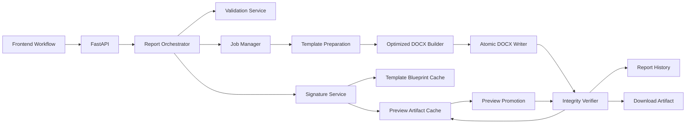

### 3.1. Trách nhiệm

| Thành phần | Trách nhiệm |
|---|---|
| Report Orchestrator | Quyết định cache hit, cold generate, dedup hoặc fallback |
| Signature Service | Xác định preview có còn khớp request hiện tại |
| Template Blueprint Cache | Cache metadata và prototype XML bất biến |
| Optimized DOCX Builder | Dựng report nhanh nhưng giữ nguyên cấu trúc |
| Preview Artifact Cache | Lưu DOCX preview cục bộ trong thời gian ngắn |
| Integrity Verifier | Kiểm tra asset, finding, section, table và relationship |
| Atomic DOCX Writer | Chỉ publish file hoàn chỉnh |
| Job Manager | Progress, cancel, dedup và giới hạn concurrency |
| Report History | Chỉ ghi một terminal record cho report cuối |

---

## 4. Luồng Preview

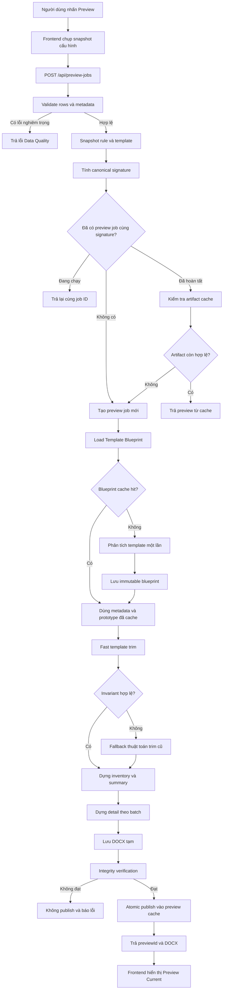

### 4.1. Nguyên tắc

- Preview chạy bằng job nền, không chặn event loop.
- Hai request cùng signature dùng chung một job.
- Artifact chỉ chuyển sang `ready` sau khi integrity đạt.
- Fast trim lỗi sẽ tự fallback về legacy trim.
- Backend, không phải frontend, quyết định cache còn hợp lệ.

---

## 5. Luồng Generate sau Preview

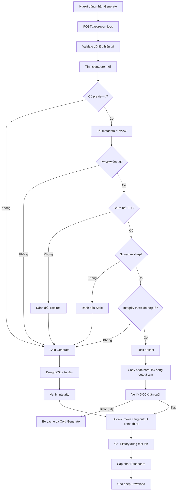

Cache miss hoặc mismatch không phải lỗi. Backend sẽ tự động chuyển sang cold
generate và giữ nguyên workflow hiện tại.

---

## 6. Luồng Cold Generate

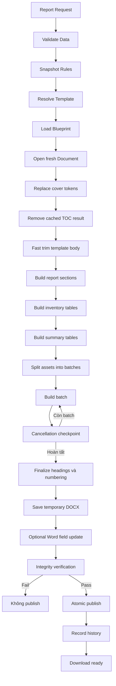

---

## 7. Tối ưu Template Body

### 7.1. Luồng hiện tại

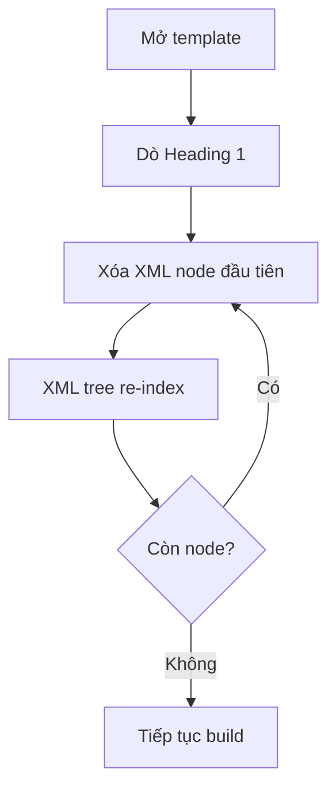

Thao tác xóa từng node có thể làm XML tree phải cập nhật chỉ mục lặp lại và dẫn đến
độ phức tạp gần O(n²).

### 7.2. Luồng tối ưu

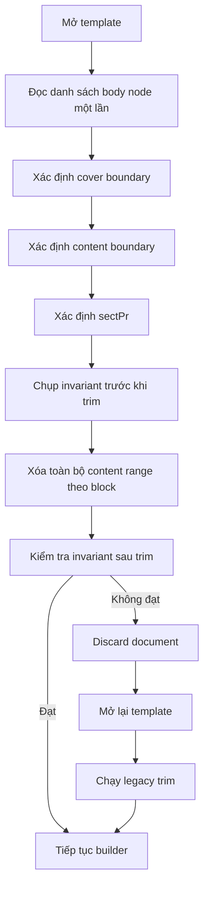

### 7.3. Invariant bắt buộc

```text
section_count_after >= 1
sectPr_after tồn tại
cover_hash_before == cover_hash_after
header_relationships_before == header_relationships_after
footer_relationships_before == footer_relationships_after
template_file_hash không thay đổi
TOC field còn tồn tại nếu template có TOC
```

### 7.4. Ảnh hưởng

| Mặt | Ảnh hưởng |
|---|---|
| Tốc độ | Dự kiến cải thiện lớn nhất |
| RAM | Có thể giảm nhẹ |
| Template gốc | Không bị sửa |
| Format | Có rủi ro nếu boundary sai |
| Rollback | Feature flag và legacy fallback |

---

## 8. Template Blueprint Cache

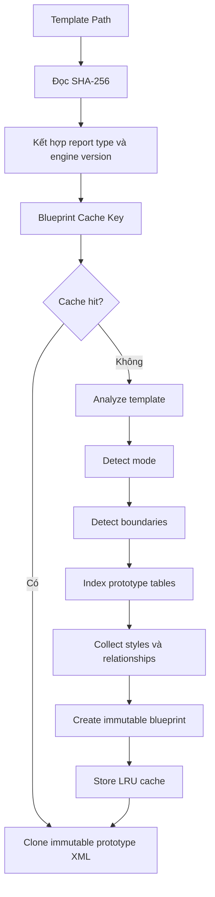

### 8.1. Blueprint model

```text
TemplateBlueprint
├── cache_key
├── template_hash
├── template_path
├── report_type
├── compatibility_version
├── template_mode
├── cover_boundary
├── content_boundary
├── section_fingerprint
├── relationship_fingerprint
├── toc_metadata
├── style_map
├── prototype_map
└── created_at
```

### 8.2. Không cache

- Đối tượng `python-docx.Document` đang chỉnh sửa.
- Dữ liệu tracking.
- Finding hoặc evidence.
- Rule output.
- Metadata khách hàng.

### 8.3. Giới hạn

- Tối đa 8 blueprint.
- LRU eviction.
- Cache chỉ nằm trong RAM.
- Xóa toàn bộ khi backend restart.
- Invalidate khi hash template hoặc engine compatibility version thay đổi.

---

## 9. Tối ưu Table Builder

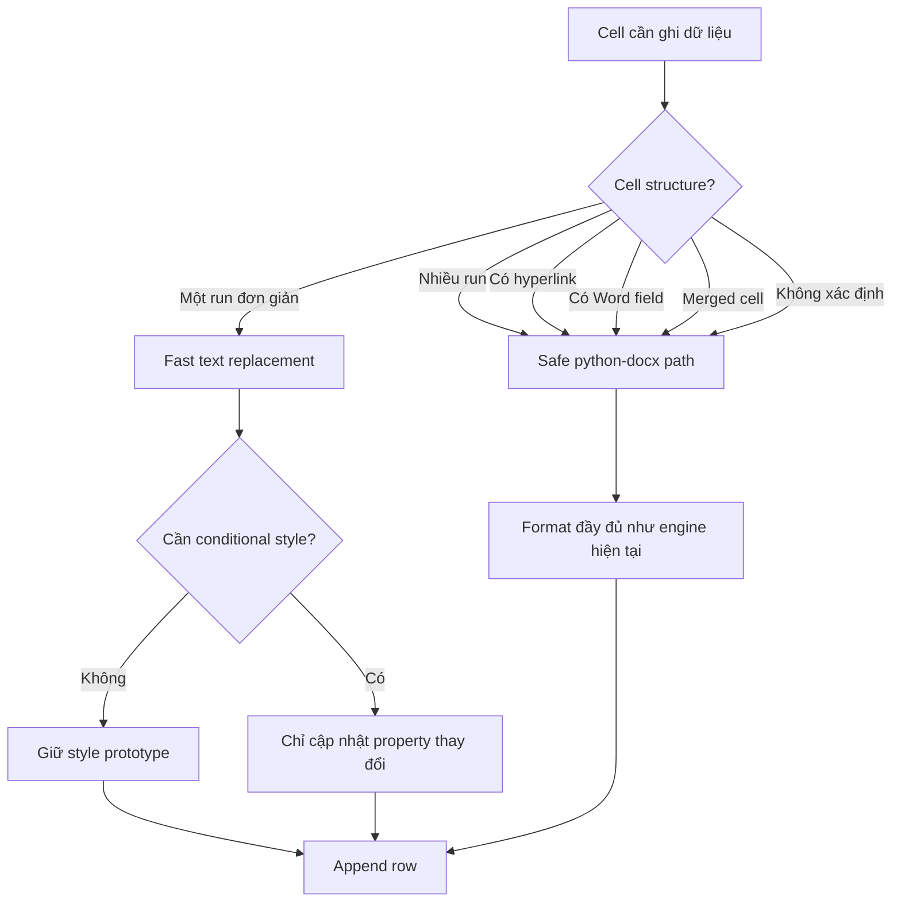

### 9.1. Fast path

- STT.
- Hostname.
- IP.
- OS.
- Asset type.
- Result thông thường.
- Note plain text.

### 9.2. Safe path

- Finding nhiều đoạn.
- Evidence.
- IoC.
- MITRE ATT&CK.
- Remediation.
- Timeline.
- Severity styling.
- Hyperlink, field hoặc merged cell.

### 9.3. Batch

Batch mặc định đề xuất: 25–50 asset.

Sau mỗi batch:

- Cập nhật progress.
- Kiểm tra cancel.
- Đo RSS.
- Ghi timing.
- Cho heartbeat và request khác cơ hội xử lý.

Không cho nhiều thread cùng chỉnh một `Document`.

---

## 10. Canonical Signature

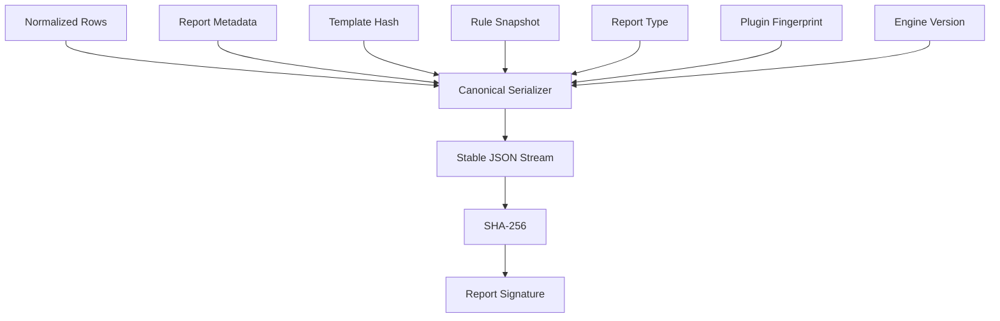

### 10.1. Thành phần

```text
signature = SHA256(
    engine_version
    + compatibility_version
    + report_type
    + template_hash
    + normalized_rows
    + row_order
    + title
    + organization
    + assessment_date
    + metadata
    + rule_snapshot_hash
    + disabled_rule_ids
    + plugin_fingerprint
)
```

### 10.2. Quy tắc canonical hóa

| Loại | Quy tắc |
|---|---|
| Dictionary | Sort theo key |
| List asset | Giữ nguyên thứ tự |
| Unicode | Chuẩn hóa NFC |
| Ngày | ISO-8601 |
| Boolean | `true/false` |
| Missing field | Chuẩn hóa về giá trị xác định |
| Rule | Hash definition đã snapshot |

Không cần đưa output filename vào signature vì đổi tên file không làm thay đổi nội
dung report.

---

## 11. State machine của Preview Artifact

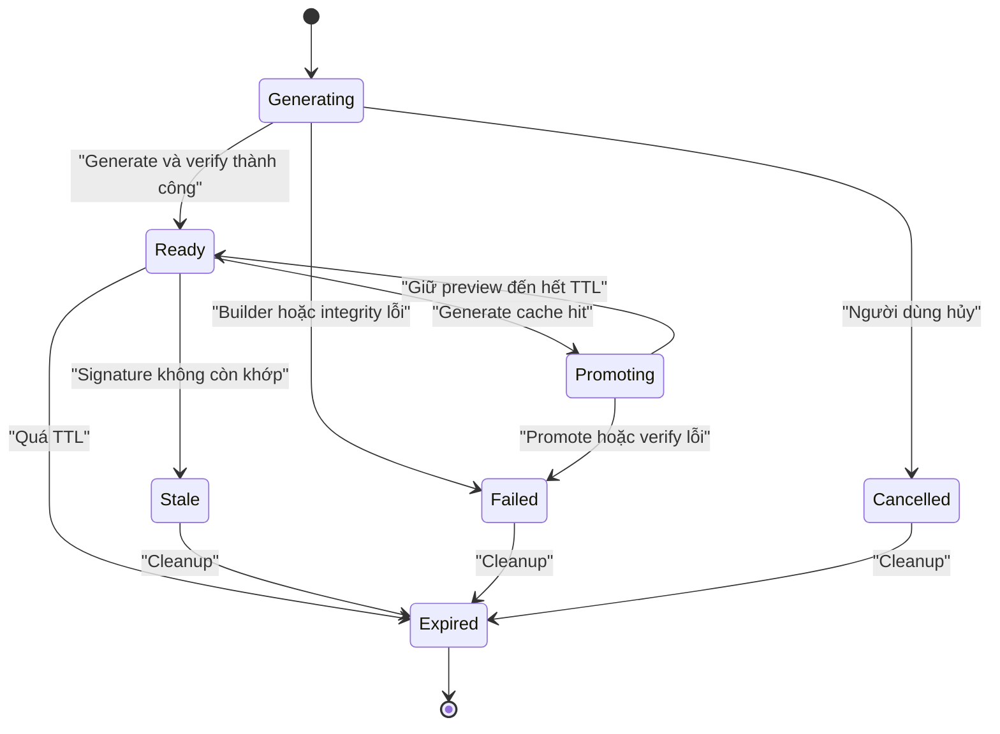

### 11.1. Quy tắc

- `Generating → Ready` chỉ khi file tồn tại và integrity đạt.
- `Ready → Promoting` phải lấy lock.
- Artifact `Promoting` không được cleanup.
- Artifact `Stale` không được dùng để Generate.
- Artifact `Failed` không được trả về frontend như preview hợp lệ.

---

## 12. Concurrency và deduplication

### 12.1. Hai Preview giống nhau

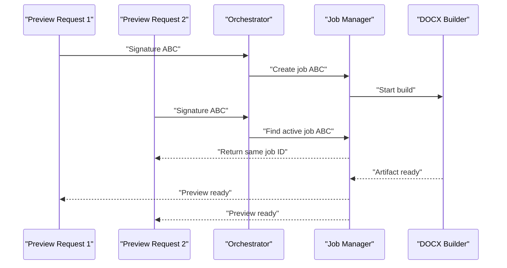

### 12.2. Preview và Generate cùng lúc

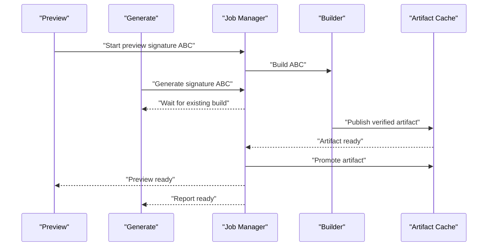

### 12.3. Quy tắc

- Hai request cùng signature không dựng hai DOCX.
- Generate có thể chờ Preview đang chạy.
- Hai lần nhấn Generate vẫn chỉ ghi một history record.
- Chỉnh dữ liệu trong lúc Preview chạy tạo signature mới, không hủy artifact cũ
  nhưng artifact cũ sẽ bị đánh dấu stale đối với workflow hiện tại.

---

## 13. Luồng lỗi và fallback

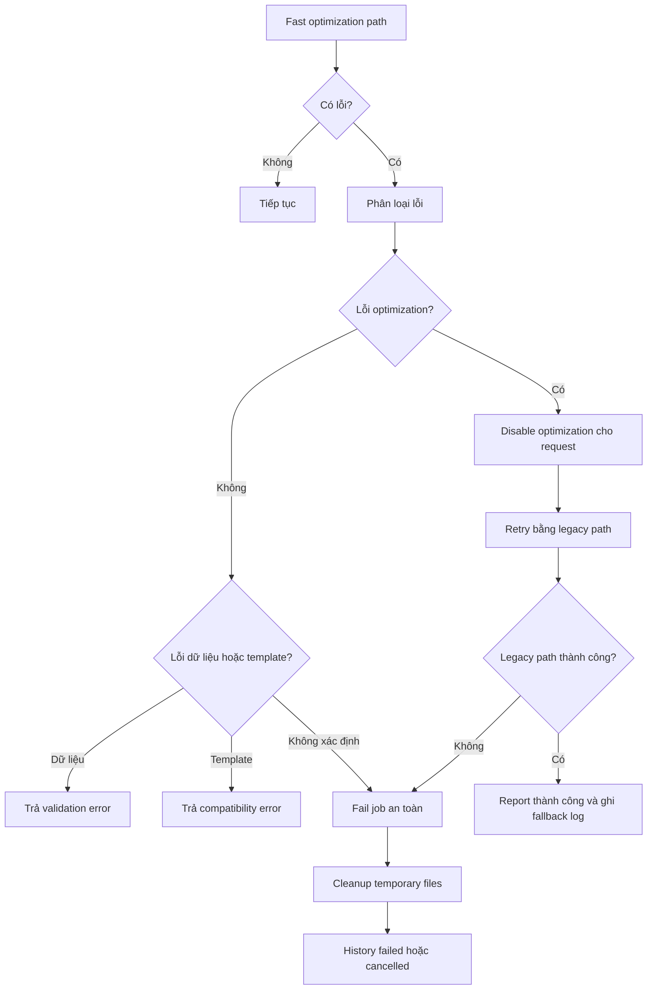

Không fallback đối với:

- Template incompatible.
- Data-quality blocking.
- Integrity fail do thiếu asset.
- Signature mismatch.
- Plugin output không xác định.

---

## 14. Cleanup cache

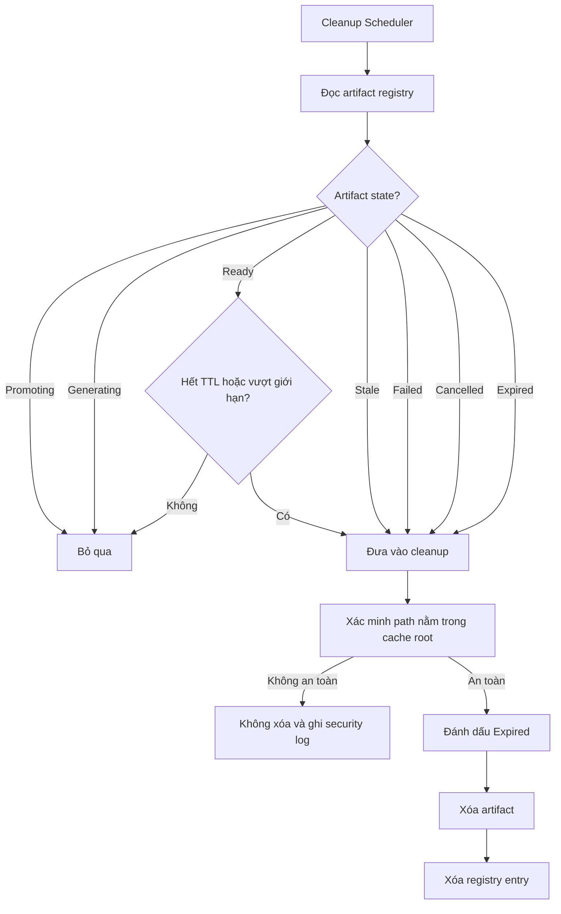

### 14.1. Giới hạn đề xuất

| Thiết lập | Giá trị |
|---|---:|
| TTL | 15 phút |
| Artifact tối đa | 2 |
| Tổng dung lượng | 1 GB |
| Cache qua restart | Không |
| Cleanup khi lỗi | Ngay lập tức |
| Cleanup khi shutdown | Có |

Cleanup chỉ được phép thao tác trong cache root đã xác minh. Template và report đã
tải không thuộc phạm vi cleanup.

---

## 15. API contract đề xuất

### 15.1. Tạo Preview Job

```http
POST /api/preview-jobs
```

```json
{
  "rows": [],
  "title": "",
  "organization": "",
  "assessmentDate": "",
  "reportType": "full",
  "templatePath": "",
  "metadata": {}
}
```

```json
{
  "job": {
    "id": "preview-job-id",
    "status": "queued",
    "signature": "sha256"
  },
  "deduplicated": false
}
```

### 15.2. Trạng thái

```http
GET /api/preview-jobs/{jobId}
```

```json
{
  "job": {
    "status": "running",
    "phase": "asset_details",
    "progress": 62
  }
}
```

### 15.3. Nội dung Preview

```http
GET /api/preview-jobs/{jobId}/content
```

Headers:

```text
X-Preview-ID
X-Preview-Signature
X-Report-Integrity
X-Template-Hash
```

### 15.4. Generate

```http
POST /api/report-jobs
```

```json
{
  "rows": [],
  "previewId": "optional-preview-id",
  "title": "",
  "organization": "",
  "reportType": "full"
}
```

Response bổ sung:

```json
{
  "job": {
    "mode": "preview_cache_hit",
    "status": "queued"
  }
}
```

---

## 16. Thay đổi frontend

### 16.1. State

```text
previewState
├── status: none | generating | current | stale | failed
├── previewId
├── signature
├── generatedAt
├── templateHash
└── integrity
```

### 16.2. Invalidation

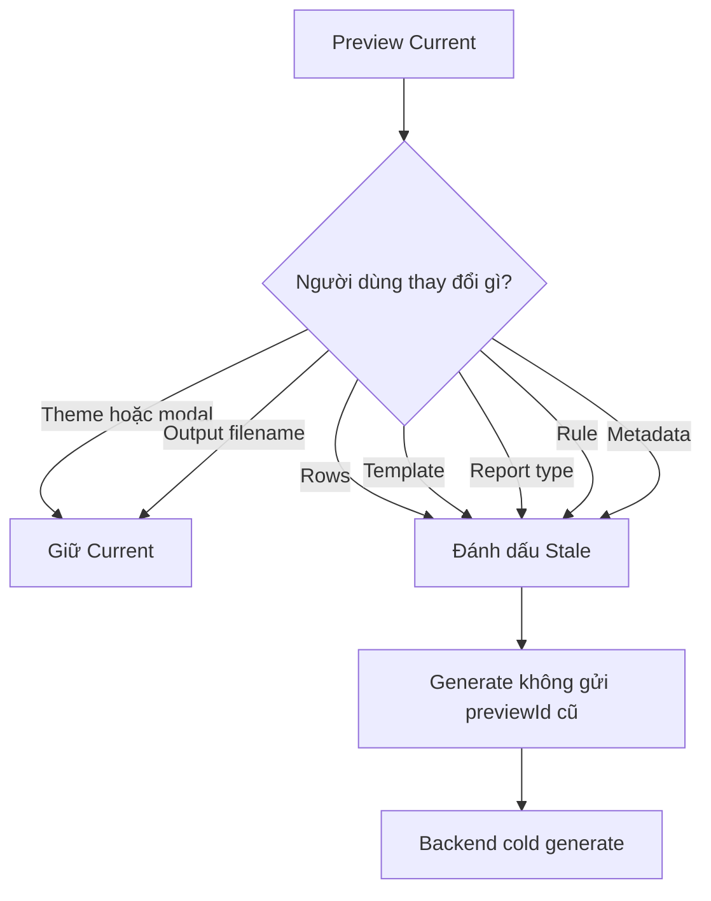

### 16.3. UX

- Badge `Preview hiện tại`.
- Badge `Dữ liệu đã thay đổi`.
- Cache hit hiển thị `Đang sử dụng bản preview đã xác nhận`.
- Cache miss dùng progress generate hiện tại.
- Không hiển thị hash hoặc đường dẫn cache.

---

## 17. Progress

### 17.1. Cold generate

```text
10%  Validate
20%  Prepare template
35%  Inventory
40–80% Asset detail batches
88%  Save DOCX
94%  Verify integrity
100% Complete
```

### 17.2. Cache hit

```text
10%  Validate preview
45%  Verify cached artifact
75%  Prepare download
95%  Record history
100% Complete
```

---

## 18. Metrics

Mỗi Preview/Generate cần ghi:

```json
{
  "mode": "cold_generate | preview_cache_hit",
  "rows": 50,
  "templatePrepareMs": 0,
  "templateTrimMs": 0,
  "prototypeIndexMs": 0,
  "tableBuildMs": 0,
  "saveMs": 0,
  "fieldUpdateMs": 0,
  "integrityMs": 0,
  "totalMs": 0,
  "peakRssMb": 0,
  "outputBytes": 0,
  "cacheHit": false,
  "fallbackUsed": false
}
```

Giai đoạn đầu chỉ log JSON. Chưa thay database schema cho đến khi format metrics ổn
định.

---

## 19. Feature flags và rollback

```text
AUTO_REPORT_FAST_TEMPLATE_TRIM=1
AUTO_REPORT_TEMPLATE_BLUEPRINT_CACHE=1
AUTO_REPORT_FAST_TABLES=1
AUTO_REPORT_PREVIEW_CACHE=0
```

Quy tắc rollback:

1. Tắt riêng feature gây lỗi.
2. Restart backend.
3. Không cần rollback database.
4. Không sửa template.
5. Report đã tạo không bị ảnh hưởng.
6. Cache cũ bị bỏ qua và hết hạn.

Preview cache để tắt mặc định trong giai đoạn prototype.

---

## 20. Work Breakdown Structure

### WP-A — Instrumentation

Backend:

- Tạo `GenerationMetrics`.
- Thêm timer context manager.
- Đo từng phase.
- Log JSON một dòng/job.
- Không ghi raw tracking vào log.

Điều kiện hoàn thành:

- Có baseline ổn định cho 50 máy.
- Timing phase cộng lại hợp lý với total.
- Lỗi/cancel vẫn ghi được phase đã chạy.

### WP-B — Fast Template Trim

Backend:

- Boundary detector.
- Block trim.
- Invariant verifier.
- Legacy fallback.
- Feature flag.

Kiểm thử:

- Cover hash.
- Section count.
- Header/footer relationship.
- TOC field.
- Sáu report type.
- Template tùy chỉnh.

Điều kiện hoàn thành:

- Golden test đạt.
- Không visual regression.
- Template preparation giảm rõ rệt.

### WP-C — Blueprint Cache

Backend:

- Template hash service.
- Blueprint extractor.
- LRU cache.
- Invalidation.
- Thread-safe read.

Kiểm thử:

- Cache hit/miss.
- Upload invalidation.
- Rollback invalidation.
- Không chia sẻ mutable state.

Điều kiện hoàn thành:

- Cold và warm output giống nhau.
- Cache không chứa dữ liệu tracking.

### WP-D — Fast Table Builder

Backend:

- Cell classifier.
- Fast text path.
- Safe path.
- Conditional style updater.
- Batch checkpoint.

Kiểm thử:

- Simple/rich cell.
- Hyperlink.
- Merged cell.
- Finding/evidence.
- Integrity 50 và 1.000 asset.

Điều kiện hoàn thành:

- Không visual diff ngoài ý muốn.
- Cancel hoạt động giữa batch.
- Tốc độ cải thiện theo số asset.

### WP-E — Preview Artifact Cache

Backend:

- Canonical signature.
- Artifact registry.
- Preview job API.
- Promote logic.
- TTL, size limit và locking.

Frontend:

- Lưu preview ID.
- Current/stale state.
- Gửi preview ID khi Generate.
- Cache-hit progress.

Điều kiện hoàn thành:

- Generate từ preview đạt mục tiêu.
- Cache invalidation đầy đủ.
- Cache mismatch fallback an toàn.
- Không ghi history hai lần.

---

## 21. Ma trận ảnh hưởng

| Thay đổi | Tốc độ | RAM | Rủi ro format | UX |
|---|---:|---:|---:|---:|
| Bulk trim XML | Rất lớn | Giảm nhẹ | Trung bình | Không |
| Blueprint cache | Trung bình | Tăng rất ít | Thấp | Không |
| Fast table formatting | Lớn với report dài | Giảm | Trung bình–cao | Không |
| Preview artifact cache | Generate rất lớn | Ít | Thấp nếu hash đúng | Có |
| Batch raw XML | Rất lớn ở hàng nghìn máy | Có thể giảm mạnh | Cao | Không |
| Bỏ Word fields | Rất nhỏ | Không đáng kể | Có thể sai TOC | Không làm |
| Bỏ rule/validate | Gần như không cải thiện | Không đáng kể | Giảm chất lượng | Không làm |

---

## 22. Benchmark plan

Mỗi mốc chạy tối thiểu ba chế độ:

1. Cold run.
2. Warm template cache.
3. Preview cache hit Generate.

Thu thập:

```text
wall time
CPU time
peak RSS
output size
template prepare time
table build time
integrity time
cache hit/miss
fallback count
asset count
finding count
```

| Assets | Preview cold | Generate cold | Generate cache hit | Peak RAM | Integrity |
|---:|---:|---:|---:|---:|---|
| 50 | Bắt buộc | Bắt buộc | Bắt buộc | Bắt buộc | Bắt buộc |
| 1.000 | Bắt buộc | Bắt buộc | Bắt buộc | Bắt buộc | Bắt buộc |
| 3.000 | Bắt buộc | Bắt buộc | Bắt buộc | Bắt buộc | Bắt buộc |
| 3.750 | Bắt buộc | Bắt buộc | Bắt buộc | ≤3 GB | Bắt buộc |
| 4.000+ | Thử nghiệm | Thử nghiệm | Không công bố | Watchdog | Bắt buộc |

Mục tiêu ban đầu:

- Cold generate 50 máy giảm ít nhất 40%.
- Preview 50 máy mục tiêu dưới 8–10 giây.
- Generate cache hit mục tiêu dưới 2 giây.
- Không tăng peak RAM tại mốc 3.750 máy.
- Integrity luôn `True`.

Các con số mục tiêu không được công bố thành benchmark mới trước khi đo thực tế.

---

## 23. Quality Gates

```mermaid
flowchart LR
    A["Code Complete"] --> B["Unit Tests"]
    B -->|"Pass"| C["API Integration"]
    C -->|"Pass"| D["Golden DOCX"]
    D -->|"Pass"| E["Visual Render"]
    E -->|"Pass"| F["Tracking.csv"]
    F -->|"Pass"| G["Tracking_2.csv"]
    G -->|"Pass"| H["Large Benchmark"]
    H -->|"Pass"| I["Enable Feature Flag"]
    I --> J["Release Candidate"]
```

Bắt buộc:

- Backend tests đạt.
- Frontend tests đạt.
- Production build đạt.
- Sáu golden report type đạt.
- `Tracking.csv` đủ 30 máy và 8 bất thường.
- `Tracking_2.csv` đủ 50 máy.
- Không mất relationship, header hoặc footer.
- Integrity `True`.
- Lifecycle không ngắt khi CPU bận.
- Peak RAM không vượt mức cho phép.

---

## 24. Rollout

### Stage 1 — Internal Off

Code tồn tại nhưng feature flag tắt.

### Stage 2 — Benchmark Only

Chỉ bật trong script benchmark.

### Stage 3 — Builder Optimization On

Bật:

```text
FAST_TEMPLATE_TRIM
TEMPLATE_BLUEPRINT_CACHE
FAST_SIMPLE_CELLS
```

Preview cache vẫn tắt.

### Stage 4 — Preview Cache Prototype

Chỉ bật local development để kiểm tra workflow và UX.

### Stage 5 — Local/Team Default

Chỉ bật mặc định sau khi đạt toàn bộ quality gate.

---

## 25. Thứ tự triển khai và điểm dừng

### Sprint A — Builder Foundation

1. Instrumentation.
2. Fast trim.
3. Invariant validation.
4. Legacy fallback.
5. Benchmark 50 máy.

**Điểm dừng:** Báo cáo kết quả trước/sau.

### Sprint B — Template và Table

1. Blueprint cache.
2. Prototype index.
3. Fast path cho simple cell.
4. Safe path cho rich cell.
5. Benchmark 50 và 1.000 máy.

**Điểm dừng:** Chỉ tiếp tục nếu format hoàn toàn ổn.

### Sprint C — Preview Reuse Prototype

1. Artifact cache.
2. Canonical signature.
3. Cache hit/miss API.
4. Generate promotion.
5. TTL và cleanup.
6. Frontend current/stale.

**Điểm dừng:** Duyệt workflow và UX trước khi bật mặc định.

### Sprint D — Benchmark lớn

1. 1.000 máy.
2. 3.000 máy.
3. 3.750 máy.
4. So sánh thời gian, RAM và integrity.

### Sprint E — Raw XML Batch

Chỉ nghiên cứu nếu Sprint A–D chưa đạt hiệu năng mong muốn.

---

## 26. Quyết định kiến trúc đề xuất

| Vấn đề | Quyết định |
|---|---|
| Preview đầy đủ hay rút gọn | Preview đầy đủ |
| Số preview cache | Tối đa 2 |
| TTL | 15 phút |
| Dung lượng cache | Tối đa 1 GB |
| Cache qua restart | Không |
| Cache mutable Document | Không |
| Cache immutable blueprint | Có |
| Generate cache hit vẫn dùng job | Có |
| Cache mismatch | Cold generate |
| Fast trim lỗi | Legacy fallback |
| Parallel chỉnh cùng Document | Không |
| Batch asset | 25–50 asset |
| Raw XML trực tiếp | Chỉ sau benchmark |

---

## 27. Kết luận

Phương án cân bằng nhất:

1. Tối ưu bulk trim.
2. Cache blueprint template.
3. Tối ưu simple cell formatting.
4. Giữ Preview đầy đủ và chính xác.
5. Dùng preview artifact cho Generate khi signature khớp.
6. Giữ legacy fallback và feature flag.
7. Chỉ nâng benchmark sau khi kiểm thử thực tế.

Thiết kế này ưu tiên chất lượng report, khả năng truy vết và rollback trước khi
chuyển sang các tối ưu raw XML có rủi ro cao hơn.
